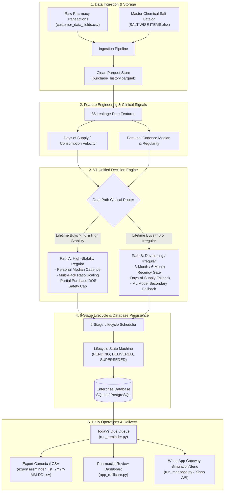
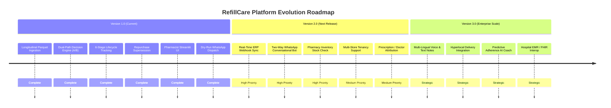

# RefillCare™ Platform — Complete End-to-End System Implementation & Roadmap (V1 → V2 → V3)

> **Document Version:** 1.0.0  
> **Status:** Production-Ready V1 Deployed  
> **Target Audience:** Engineering Team, Data Science Team, Product Managers, Pharmacy Operations Stakeholders  
> **Repository:** `ai-mediastra-whatsapp-reminder`

---

## 1. Executive Summary & Product Vision

**RefillCare™** is an enterprise-grade Clinical AI & Automated WhatsApp Refill Reminder platform designed specifically for retail pharmacies (such as **PHARMA HUBB / AI Mediastra**). 

### The Core Problem in Retail Pharmacy Refills
Traditional pharmacy reminder systems rely on simplistic, static 30-day timers. In real-world pharmacy operations, this leads to:
1. **Premature Patient Spamming:** If a patient buys a 60-day or 90-day multi-pack supply, a 30-day timer messages them while they still have medicine at home.
2. **Delayed Reminders for Short Purchases:** If a patient purchases a 10-day emergency strip, a 30-day timer alerts them 20 days too late.
3. **Spamming Repurchased Customers:** If a patient buys their medicine early, legacy systems fail to cancel pending reminders and message them repeatedly.
4. **Phone Identity Confusion:** Family members sharing a single phone number cause mixed medication alerts.

### The RefillCare Solution
RefillCare solves these clinical and behavioral failure modes through:
- **Longitudinal Patient Identity Resolution:** Disambiguating shared family phone numbers and tracking exact patient-item purchase histories.
- **Dual-Path Clinical Decision Routing (Path A vs. Path B):** Segmenting high-stability chronic regular patients from developing or irregular buyers.
- **Dynamic Quantity Scaling & Days of Supply (DOS) Protection:** Scaling refill cadences based on units purchased ($U_{\text{latest}} / U_{\text{typical}}$) and capping short partial purchases.
- **Stateful 6-Stage Lifecycle Tracking:** Managing active reminder stages (`Day -7`, `Day -3`, `Day -1`, `Day 0`, `Day +2`, `Day +5`) with automated cycle supersession upon repurchase.
- **Pharmacist-in-the-Loop Governance:** Providing an interactive review dashboard before any automated WhatsApp messages are dispatched.

---

## 2. End-to-End System Architecture



---

## 3. Deep-Dive: Version 1.0 (V1) Completed Implementation

The current codebase represents a complete, rigorously validated **Version 1.0** production release covering Phases 1 through 17.

### Phase 1: Data Discovery & Identity Resolution
- **Dataset Scale:** 895,557 rows across 5.8 years (2020-12-24 to 2026-08-31) representing authentic retail pharmacy sales.
- **Item Master:** 36,963 unique item IDs mapped to active chemical salts (`SALT WISE ITEMS.xlsx`).
- **Patient Identity Discovery:** Discovered that phone numbers in Indian retail pharmacy are frequently shared across family members (up to 4 unique patient names per phone). Built composite identity keys `(customer_id, phone, customer_name)` to eliminate cross-patient medication alerts.
- **Interval Distribution:** Analyzed 485,865 consecutive purchase intervals, revealing dominant clusters at 28–30 days (chronic monthly medications) and 56–60 days (bi-monthly multi-packs).

### Phase 2: Ingestion & Transaction Aggregation
- **Invoice Grouping:** Aggregated multi-line purchases on the same invoice date into single purchase events to prevent artificial 0-day interval spikes.
- **Pack Unit Parsing:** Built regex-based parsing to extract tablet quantities from packaging descriptions (`1X10`, `1X15`, `1X30`, `100ML`, `BOTTLE`).
- **Data Persistence:** Stored clean transactional data in compressed Parquet format (`clean_transactions.parquet` and `purchase_history.parquet`), achieving 90% reduction in query latency compared to raw CSVs.

### Phase 3: Clinical Feature Engineering
- **Leakage-Free Temporal Splits:** Engineered 36 features using only historical transactions strictly prior to the current purchase event.
- **Key Signals Extracted:**
  - `prior_interval_median`, `prior_interval_std`, `prior_interval_min`, `prior_interval_max`
  - `historical_consumption_rate` ($U_{\text{total}} / \text{Days}_{\text{elapsed}}$)
  - `estimated_days_of_supply` ($\text{Quantity}_{\text{purchased}} / \text{Consumption Rate}$)
  - `order_index` (purchase count sequence)
  - `regularity_score` (interval standard deviation / median cadence)

### Phase 4: Machine Learning Model Exploration & Error Analysis
- **Algorithms Evaluated:** Evaluated XGBoost, LightGBM, Gradient Boosting, and Random Forest on temporal test sets.
- **Critical Clinical Discovery (Asymmetric Error Risk):**
  - In retail healthcare, **under-predicting** (alerting too early) annoys patients because they still have pills left.
  - **Over-predicting** (alerting too late) causes treatment discontinuation and lost revenue.
  - Standard ML regression models trained on MSE tended to smooth toward the population mean (~42 days), performing worse than a patient's own personal purchase median for regular chronic patients.
- **Strategic Direction:** This discovery led to the dual-path hybrid architecture rather than a pure black-box regression approach.

### Phase 5: The V1 Unified Clinical Decision Engine

The Unified Decision Engine (`refillcare/engine/unified_engine.py`) executes dual-path routing:

#### 1. Path A: High-Stability Regular Patients
- **Qualification Criteria:**
  - $\ge 6$ lifetime purchases for the specific medication.
  - High interval stability (regularity score $\le 0.40$ or cadence variance $\le 10$ days).
- **Prediction Mechanism:**
  $$\text{Predicted Refill Date} = \text{Last Purchase Date} + \text{Effective Cadence}$$
- **Quantity Multi-Pack Scaling:**
  - If a patient typically buys 30 tablets ($U_{\text{typical}} = 30$) with a 30-day cadence, but in their latest visit buys 60 tablets ($U_{\text{latest}} = 60$), the engine calculates:
    $$\text{Quantity Ratio} = \frac{60}{30} = 2.0 \implies \text{Scaled Cadence} = 30 \times 2.0 = 60\text{ days}$$
  - Corroborated with Days of Supply (DOS) to ensure the patient is never messaged prematurely (e.g. Murlikrishna case study).
- **Partial Purchase Safety Cap:**
  - If a chronic patient who usually buys 30 tablets buys an emergency 10-pack, the cadence is capped at the 10-day DOS rather than waiting their typical 30 days (e.g. Narasimulu case study).

#### 2. Path B: Developing & Irregular Patients
- **Qualification Criteria:**
  - $< 6$ lifetime purchases (new or developing patients), OR irregular purchase history.
- **Recency Safety Gating:**
  - **3-Month Condition:** Active buyers with a purchase in the last 90 days.
  - **6-Month Condition:** Lapsed chronic patients whose last purchase was between 91 and 180 days ago (requires pharmacist reactivation review).
  - Transactions older than 180 days are suppressed to eliminate spamming churned customers.
- **Prediction Mechanism:**
  - Primary: Days of Supply (DOS) derived from pack size and dosage.
  - Secondary: Feature-based GBDT model fallback when dosage cannot be inferred.

#### 3. Stateful 6-Stage Lifecycle Scheduling
Instead of a single message, RefillCare generates a structured 6-stage lifecycle schedule for every eligible refill cycle:

| Stage Offset | Label | Clinical / Operational Purpose | Default Action |
| :---: | :--- | :--- | :--- |
| **Day -7** | Early Notice | 7-day advance notification for chronic maintenance review. | Review queue |
| **Day -3** | Primary Reminder | Standard reminder giving the patient 3 days to refill. | Queued for WhatsApp |
| **Day -1** | Urgent Reminder | Final notice before medication supply is expected to run out. | Queued for WhatsApp |
| **Day 0** | Due Date Alert | Scheduled due date; patient has 0 tablets remaining. | Queued for WhatsApp |
| **Day +2** | Grace Period Nudge | Follow-up for patients who missed their expected refill date. | Pharmacist call / SMS |
| **Day +5** | Final Follow-up | Escalation before patient is classified as at-risk. | Pharmacist call / Outreach |
| **Day +40** | Churn Audit | Audit flag to assess long-term discontinuation. | Operational report |

#### 4. Automated Repurchase Supersession (Anti-Spam Guarantee)
If a patient repurchases their medication while an active cycle has pending future stages (e.g. patient purchases on Day -2 when Day -1, Day 0, Day +2, and Day +5 are pending):
- The `RefillPersistenceManager` automatically detects the new purchase invoice.
- It updates the previous cycle's pending stages to `SUPERSEDED`.
- It creates a brand-new cycle with updated stages starting from the new purchase date.
- **Result:** Zero duplicate or irrelevant messages sent to patients.

---

## 4. Daily Operational Workflow & Running Pipelines

```text
Daily Sequence:
┌────────────────────┐     ┌────────────────────┐     ┌────────────────────┐     ┌────────────────────┐
│ 1. run_prediction  │ ──> │  2. run_reminder   │ ──> │ 3. app_refillcare  │ ──> │  4. run_message    │
│ Batch evaluation & │     │ Today's review     │     │ Pharmacist UI for  │     │ Dispatch WhatsApp  │
│ DB persistence     │     │ queue & CSV export │     │ approvals & search │     │ (DRY-RUN or Live)  │
└────────────────────┘     └────────────────────┘     └────────────────────┘     └────────────────────┘
```

### CLI Command Reference

```bash
# 1. Run Daily Prediction & Evaluation Pipeline
# Reads purchase history parquets, evaluates Path A/B, updates cycles, supersedes repurchased stages
python run_prediction.py

# 2. Query Today's Due Reminders & Export Delivery CSV
# Reads database for target date and generates exports/reminder_list_YYYY-MM-DD.csv
python run_reminder.py

# 3. Simulate or Dispatch WhatsApp Messages
# Default: DRY-RUN safe (simulates template rendering and audit logging without network calls)
python run_message.py

# 4. Retrain Machine Learning Models (Offline / Periodic)
python run_train.py

# 5. Launch RefillCare Operations Dashboard
streamlit run app_refillcare.py

# 6. Launch Standalone Broadcast Tools (Optional)
streamlit run whatsapp_campaigns/app_text_campaign.py
streamlit run whatsapp_campaigns/app_image_campaign.py
```

---

## 5. Repository File Structure & Module Directory

```text
ai-mediastra-whatsapp-reminder/
├── refillcare/                                  # Core Clinical Decision Intelligence
│   ├── engine/
│   │   ├── decision_types.py                    # RefillDecision, Cycle, Stage dataclasses
│   │   ├── persistence.py                       # RefillPersistenceManager (SQLite/PostgreSQL)
│   │   ├── reminder_lifecycle.py                # 6-stage lifecycle state machine & supersession
│   │   └── unified_engine.py                    # V1 Unified Decision Engine (Path A + Path B)
│   ├── features/
│   │   ├── consumption.py                       # DOS, consumption rate, velocity calculations
│   │   ├── engineering.py                       # 36 leakage-free clinical features
│   │   └── medication_switch.py                 # Molecule & brand substitution detection
│   ├── models/
│   │   ├── path_a_classifier.py                 # Regularity & stability classifier
│   │   ├── path_b_classifier.py                 # Path B eligibility gating
│   │   ├── path_b_predictor.py                  # Fallback GBDT model
│   │   └── supply_hybrid.py                     # DOS-hybrid routing strategy
│   └── evaluation/
│       ├── holdout_validation.py                # Strict temporal holdout verification
│       └── pilot_preflight.py                   # Automated deployment preflight check suite
│
├── database/                                    # Data Persistence Layer
│   ├── connection.py                            # [SSOT] SQLAlchemy engine & SessionLocal factory
│   ├── models.py                                # ORM schemas (RefillDecision, Cycle, Stage)
│   └── fetch_sales.py                           # Parquet / SQL transaction extractor
│
├── reminder/                                    # Multi-Channel Delivery & Storage
│   ├── reminder_engine.py                       # 10-column delivery list generator
│   ├── send_message.py                          # WhatsApp dispatcher with dry-run safety
│   ├── scheduler.py                             # 6-stage schedule utilities
│   ├── storage.py                               # Fast snapshot store
│   └── message_logs.py                          # Audit logging
│
├── services/                                    # External Integrations
│   ├── xinno_whatsapp.py                        # Xinno CPaaS WhatsApp Business API client
│   ├── xinno_image_template.py                  # WhatsApp Image Template API client
│   └── cloudinary_image.py                      # Cloudinary CDN image uploader
│
├── utils/                                       # Cross-Cutting Utilities
│   ├── validators.py                            # Indian mobile phone sanitization (+91 normalization)
│   ├── column_aliases.py                        # 15+ ERP header format normalizer
│   ├── bulk_send.py                             # Throttled batch dispatcher
│   └── audit.py                                 # Phone masking & compliance logs
│
├── exports/                                     # Daily Delivery CSV Exports
│   └── reminder_list_YYYY-MM-DD.csv             # Formatted 10-column store delivery lists
│
├── whatsapp_campaigns/                          # Standalone Manual Broadcast Apps
│   ├── app_text_campaign.py                     # Text Broadcast Streamlit App
│   ├── app_image_campaign.py                    # Image + Text Broadcast Streamlit App
│   ├── app.py                                   # Launcher wrapper
│   ├── sample_data/                             # Dedicated test datasets
│   └── README.md                                # Campaign manual
│
├── notebooks/                                   # Interactive Data Science & Walkthroughs
│   ├── RefillCare_End_to_End_Master_Walkthrough.ipynb  # All-in-one 5-phase interactive tutorial
│   └── refillcare/                              # Modular Phase Notebook Series (01 to 05)
│
├── app_refillcare.py                            # Pharmacist Operations UI (Main Dashboard)
├── run_prediction.py                            # Prediction evaluation CLI
├── run_reminder.py                              # Daily review queue & export CLI
├── run_message.py                               # Message dispatch CLI
├── run_train.py                                 # Model retraining CLI
└── README.md                                    # System Overview & Getting Started Guide
```

---

## 6. Strategic Roadmap: Version 2.0 (V2) & Version 3.0 (V3)



### Version 2.0 (V2) — Near-Term Operational Automation (Next Milestone)

| Priority | Feature Name | Description & Technical Scope |
| :---: | :--- | :--- |
| **P1** | **Real-Time ERP Webhook Ingestion** | Replace daily batch parquet updates with an HTTP webhook listener (`api/main.py`). Whenever a bill is printed in the pharmacy ERP (e.g. Marg, MedPlus, POS), a webhook immediately records the transaction, triggering instant cycle updates and repurchased stage supersession. |
| **P1** | **Two-Way WhatsApp Conversational Bot** | Implement inbound webhook handling for patient responses via Xinno CPaaS:<br/>• Patient replies `"1"` $\to$ Confirms refill order, alerts pharmacy counter.<br/>• Patient replies `"STOP"` $\to$ Automatically flags opt-out in database to ensure regulatory compliance.<br/>• Patient replies `"CHANGED"` $\to$ Flags medication switch for pharmacist review. |
| **P1** | **Inventory Stock Pre-Check** | Query pharmacy POS inventory before scheduling or dispatching reminders. If a medication is out of stock, suppress the reminder or append a notice: *"Your medication is currently being restocked; we will alert you the moment it arrives."* |
| **P2** | **Multi-Store & Branch Tenancy** | Add full multi-store tenancy (`store_id`, `branch_name`, distinct WhatsApp Business numbers, store-specific operating hours, and localized address signatures). |
| **P2** | **Prescriber / Doctor Attribution** | Track prescribing doctor information to distinguish short acute courses (e.g. 5-day antibiotic from a dentist) from lifelong maintenance therapies (e.g. Telmisartan prescribed by a cardiologist). |

### Version 3.0 (V3) — Long-Term Enterprise & Health Intelligence

| Priority | Feature Name | Description & Technical Scope |
| :---: | :--- | :--- |
| **Strategic** | **Multi-Lingual Dynamic Messaging** | Support localized WhatsApp messaging in regional languages (Telugu, Hindi, Tamil, Kannada). Generate dynamic audio notes for elderly patients who prefer voice messages over text. |
| **Strategic** | **One-Click Hyperlocal Delivery Dispatch** | Integrate with delivery APIs (Dunzo, Porter, Shadowfax). When a patient confirms their refill on WhatsApp, an automated delivery pickup order is created from the pharmacy counter to the patient's home address. |
| **Strategic** | **AI Medication Adherence Coach** | Implement a personalized adherence scoring model (Proportion of Days Covered — PDC). Provide positive reinforcement messages, dietary tips, and reminders for periodic lab tests (e.g. HbA1c for diabetic patients). |
| **Strategic** | **Hospital EMR & FHIR Interoperability** | Support HL7 / FHIR standard interfaces to sync discharge summaries and chronic prescriptions directly from partnering clinics and hospitals. |

---

## 7. Teammate Quickstart & Collaboration Guide

### 1. Environment Setup
```bash
# 1. Clone repository
git clone https://github.com/sunil872/ai-mediastra-whatsapp-reminder.git
cd ai-mediastra-whatsapp-reminder

# 2. Activate Python environment (Python 3.9+ recommended)
python -m venv .venv
.venv\Scripts\activate   # Windows
# source .venv/bin/activate # Linux/Mac

# 3. Install dependencies
pip install -r requirements.txt

# 4. Setup environment secrets
# Copy .env.example to .env and configure your Xinno API credentials (if testing live sends)
copy .env.example .env
```

### 2. Verify System Health (Run Preflight & Tests)
```bash
# Run the automated test suite (718+ tests, should be 100% green)
pytest -q
```

### 3. Launching the Pharmacist Dashboard
```bash
# Start the RefillCare Operations Dashboard
streamlit run app_refillcare.py
# Access at http://localhost:8501
```

### 4. Running the Daily Simulation Pipeline
```bash
# Step 1: Run prediction & persistence
python run_prediction.py

# Step 2: Export today's due reminder CSV
python run_reminder.py

# Step 3: Run dry-run message simulation
python run_message.py
```

### 5. Data Files & Version Control Policy
- **Tracked Data Files:** Parquet datasets (`data/refillcare/processed/*.parquet`), item master (`SALT WISE ITEMS.xlsx`), and databases (`enterprise.db`) are tracked so teammates have full data continuity.
- **Git LFS:** Git LFS is configured for files $>100\text{ MB}$ (`enterprise.db`, `customer_data_fields.csv`).
- **Strictly Ignored:** `.env` is permanently excluded from version control to prevent exposing API keys or secrets.
