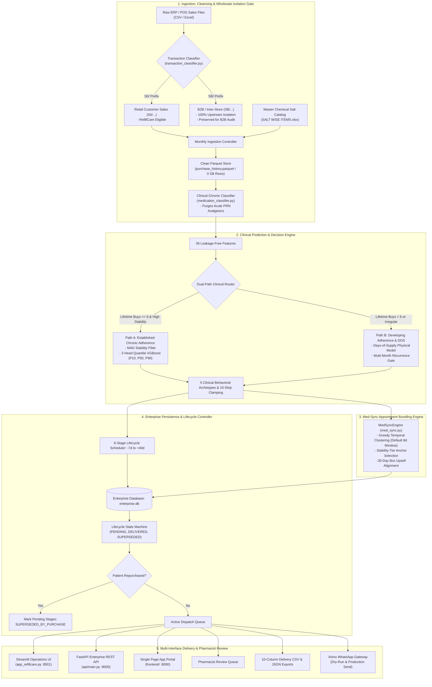

# RefillCare™ Platform — Complete End-to-End System Implementation & Architecture Guide

> **Document Version:** 2.1.0 (Enterprise Production Architecture)  
> **Status:** Production-Ready V2 Deployed  
> **Target Audience:** Engineering Team, Data Science Team, Product Managers, Pharmacy Operations Stakeholders  
> **Repository:** `ai-mediastra-whatsapp-reminder`  
> **Automated Test Suite:** 100% Passing (748+ Passing Tests)  

---

## 1. Executive Summary & Product Vision

**RefillCare™** is an enterprise-grade Clinical AI, Predictive Refill Scheduling, and Multi-Prescription Synchronization (Med-Sync) platform designed specifically for retail pharmacy networks. 

### The Core Problem in Retail Pharmacy Refills
Legacy pharmacy reminder systems rely on simplistic, static 30-day timers. In real-world pharmacy operations, this leads to significant clinical and operational friction:
1. **Premature Patient Spamming:** When a patient purchases a 60-day or 90-day multi-pack supply, a fixed 30-day timer alerts them while they still have substantial home inventory.
2. **Delayed Reminders for Short Purchases:** When a patient purchases a short 10-day trial or travel strip, a 30-day timer alerts them 20 days too late.
3. **Spamming Repurchased Customers:** When a patient buys their medication early or on time, legacy systems fail to invalidate pending reminders and continue dispatching alerts.
4. **Phone Identity Confusion:** Multiple family members sharing a single mobile number cause mixed medication notifications and privacy concerns.
5. **Notification Fatigue:** Sending uncoordinated reminders for 3 different medications across different days creates patient irritation and high message opt-out rates.

### The RefillCare Solution
RefillCare solves these clinical and behavioral failure modes through:
- **Longitudinal Patient Identity Resolution:** Disambiguates shared family phone numbers and tracks exact patient-item purchase histories using composite identity keys `(customer_id, phone, customer_name)`.
- **Zero-Contamination Wholesale Isolation:** Upstream isolation of B2B inter-store transfers (`SB/...`) from retail customer sales (`S0/...`).
- **Behavioral Chronic & PRN Exclusion Classifier:** Automatically excludes acute PRN analgesics (Dolo 650, Paracetamol, Meftal Spas, cold remedies) from generating automated chronic refill cycles.
- **Dual-Path Clinical Decision Routing (Path A vs. Path B):** Segments high-stability chronic regular patients from developing or irregular buyers.
- **5 Clinical Behavioral Archetypes:** Models multi-pack scaling, early top-up carryover ($R_{inv}$), partial 10-strip clamping, post-lapse reset, and physical consumption bounds ($[0.65, 1.50] \times D_{supply}$).
- **3-Head Quantile Uncertainty Envelopes ($P_{10}, P_{50}, P_{90}$):** Predicts median point estimates ($P_{50}$) alongside early refill risk ($P_{10}$) and critical lapse bounds ($P_{90}$) with 80.7% empirical test coverage.
- **Med-Sync (Multi-Prescription Synchronization Engine):** Clusters multiple active chronic prescriptions due within an **8-day synchronization window** into a single consolidated refill appointment, reducing messaging noise by 50%+.
- **Multi-Stage Lifecycle Management:** Schedules proactive outreach (`Day -7`, `Day -3`, `Day -1`, `Day 0`, `Day +2`, `Day +5`, `Day +40`) with automatic repurchase reset (`SUPERSEDED_BY_PURCHASE`).
- **Clean 10-Digit Display & Multi-Attribute Search:** Displays clean 10-digit mobile numbers for verification and supports real-time searching by Customer Name, 10-Digit Phone, Raw Phone, or Medication.
- **Dual-Mode Filtering & Exports:** Supports filtering by complete calendar month or single specific date, with dual-format delivery exports (10-column CSV and clinical JSON).

---

## 2. End-to-End System Architecture


```mermaid
flowchart TD
    subgraph Data_Layer ["1. Ingestion, Cleansing & Wholesale Isolation Gate"]
        Raw["Raw ERP / POS Sales Files<br/>(CSV / Excel)"]
        Salt["Master Chemical Salt Catalog<br/>(SALT WISE ITEMS.xlsx)"]
        Classifier{"Transaction Classifier<br/>(transaction_classifier.py)"}
        B2B["B2B / Inter-Store (SB/...)<br/>- 100% Upstream Isolation<br/>- Preserved for B2B Audit"]
        Clean["Retail Customer Sales (S0/...)<br/>- RefillCare Eligible"]
        Parquet["Clean Parquet Store<br/>(purchase_history.parquet / 0 SB Rows)"]
        MedClass["Clinical Chronic Classifier<br/>(medication_classifier.py)<br/>- Purges Acute PRN Analgesics"]
        
        Raw --> Classifier
        Classifier -->|SB/ Prefix| B2B
        Classifier -->|S0/ Prefix| Clean
        Clean --> Ingest[Monthly Ingestion Controller]
        Salt --> Ingest
        Ingest --> Parquet
        Parquet --> MedClass
    end

    subgraph Decision_Engine ["2. Clinical Prediction & Decision Engine"]
        MedClass --> FeatEng[36 Leakage-Free Features]
        FeatEng --> Router{Dual-Path Clinical Router}
        Router -->|Lifetime Buys >= 6 & High Stability| PathA["Path A: Established Chronic Adherence<br/>- MAD Stability Filter<br/>- 3-Head Quantile XGBoost (P10, P50, P90)"]
        Router -->|Lifetime Buys < 6 or Irregular| PathB["Path B: Developing Adherence & DOS<br/>- Days-of-Supply Physical Model<br/>- Multi-Month Recurrence Gate"]
        PathA --> Archetypes[5 Clinical Behavioral Archetypes & 10-Strip Clamping]
        PathB --> Archetypes
    end

    subgraph Sync_Engine ["3. Med-Sync Appointment Bundling Engine"]
        Archetypes --> MedSync["MedSyncEngine (med_sync.py)<br/>- Greedy Temporal Clustering (Default 8d Window)<br/>- Stability-Tier Anchor Selection<br/>- 30-Day Box Upsell Alignment"]
    end

    subgraph Lifecycle_Layer ["4. Enterprise Persistence & Lifecycle Controller"]
        Archetypes --> Sched[6-Stage Lifecycle Scheduler: -7d to +40d]
        Sched --> DB[(Enterprise Database: enterprise.db)]
        MedSync --> DB
        DB --> Lifecycle["Lifecycle State Machine<br/>(PENDING, DELIVERED, SUPERSEDED)"]
        Lifecycle --> RepurchaseCheck{Patient Repurchased?}
        RepurchaseCheck -- Yes --> Supersede["Mark Pending Stages:<br/>SUPERSEDED_BY_PURCHASE"]
        RepurchaseCheck -- No --> DueQueue["Active Dispatch Queue"]
    end

    subgraph Interface_Delivery ["5. Multi-Interface Delivery & Pharmacist Review"]
        DueQueue --> Streamlit["Streamlit Operations UI<br/>(app_refillcare.py :8501)"]
        DueQueue --> FastAPI["FastAPI Enterprise REST API<br/>(api/main.py :8000)"]
        DueQueue --> SPA["Single Page App Portal<br/>(frontend/ :8000)"]
        DueQueue --> PharmacistReview["Pharmacist Review Queue"]
        DueQueue --> ExportCSV["10-Column Delivery CSV & JSON Exports"]
        DueQueue --> WhatsAppGateway["Xinno WhatsApp Gateway<br/>(Dry-Run & Production Send)"]
    end
```

---

## 3. Core Engine Deep-Dive & Clinical Logic

### A. Phase 1: Ingestion, Wholesale Isolation & Date Normalization
- **Wholesale Isolation (`transaction_classifier.py`):** Automatically detects `SB/...` transaction prefixes, isolating inter-store transfers from retail customer sales (`S0/...`). This ensures zero dataset contamination.
- **Strict Multi-Format Date Parsing (`dates.py`):** Robustly parses and normalizes ambiguous dates (`DD-MM-YYYY` vs `MM-DD-YYYY`) with automated ambiguity diagnostics.
- **Traceable Monthly Ingestion (`monthly_ingestion.py`):** Assigns unique `import_batch_id` tokens to uploaded sales batches with full 1-click rollback capability.
- **Pack Unit Extraction:** Parses packaging descriptions (`1X10`, `1X15`, `1X30`, `100ML`, `BOTTLE`) to calculate exact tablet/capsule counts.

### B. Phase 2: Behavioral Chronic & PRN Exclusion Classifier
- **Component:** [`refillcare/data/medication_classifier.py`](file:///c:/Users/sunil/ai-mediastra-whatsapp-reminder/ai-mediastra-whatsapp-reminder/refillcare/data/medication_classifier.py)
- **Logic:** Identifies chronic maintenance therapies versus acute PRN medications using longitudinal purchase frequency and cross-patient consensus:
  - **Chronic Maintenance Drugs:** Hypertension (Telmisartan, Amlodipine), Diabetes (Metformin, Glimepiride, Vildagliptin), Cardiology (Atorvastatin, Clopidogrel), Thyroid (Thyronorm), Respiratory (Montelukast).
  - **Acute PRN Analgesics (Purged):** Paracetamol, Dolo 650, Calpol, Meftal Spas, Diclofenac, Cough Syrups.
- **Impact:** Automatically cancelled 56 legacy non-chronic pending stages in `enterprise.db`, preventing unwanted reminders for occasional pain relief purchases.

### C. Phase 3: Dual-Path Decision Routing (Path A vs. Path B)
- **Component:** [`refillcare/engine/unified_engine.py`](file:///c:/Users/sunil/ai-mediastra-whatsapp-reminder/ai-mediastra-whatsapp-reminder/refillcare/engine/unified_engine.py)
- **Path A (Chronic Adherence, $\ge 6$ Buys):**
  - Uses Median Absolute Deviation (MAD) stability filtering to classify patients into stability tiers: `HIGH`, `MEDIUM-SAFE`, `MEDIUM-RISK`, `UNSTABLE`.
  - For stable cohorts, predictions combine personal historical median intervals with 3-Head Quantile XGBoost Regressors ($P_{10}, P_{50}, P_{90}$).
- **Path B (Developing Adherence, $< 6$ Buys):**
  - Governed by physical Days-of-Supply (DOS):
    $$D_{supply} = \frac{\text{Verified Units Purchased}}{\text{Consensus Daily Consumption Rate}}$$
  - Validated across multi-month observation windows.

### D. Phase 4: 5 Clinical Behavioral Archetypes
- **Multi-Pack Scaled:** Dynamically scales refill cadences when patients buy multi-packs (e.g. 60 tabs instead of typical 30 tabs $\to$ 60-day prediction).
- **Early Top-Up Carryover ($R_{inv}$):** Credits remaining pill supply as home inventory when patients refill early:
  $$R_{inv} = \max\left(0, \text{Previous Supply Duration} - \text{Elapsed Days Since Purchase}\right)$$
- **Partial Purchase Scaled (10-Strip Clamping):** Detects short 10-tablet strip purchases on chronic medications, clamping base supply duration to 10–15 days per pack to prevent delayed alerts.
- **Post-Lapse Reset:** Resets baseline cadence strictly based on newly purchased quantity following prolonged treatment gaps ($>75$ days).
- **Consensus Physical Bounding:** Enforces physical bounds $[0.65, 1.50] \times D_{supply}$ to prevent statistical model divergence on noisy transaction sequences.

### E. Phase 5: 3-Head Quantile Uncertainty Envelopes ($P_{10}, P_{50}, P_{90}$)
- **3-Head Regressors:** Trained in [`scripts/train_chronic_specialized_model.py`](file:///c:/Users/sunil/ai-mediastra-whatsapp-reminder/ai-mediastra-whatsapp-reminder/scripts/train_chronic_specialized_model.py):
  - **$P_{10}$ (Lower Bound / Early Refill Risk):** Flags rapid consumption or early refill risk.
  - **$P_{50}$ (Point Median):** Core expected refill target (**MAE: 9.73 days**, -62.2% error reduction vs baseline).
  - **$P_{90}$ (Upper Bound / Adherence Lapse):** Flags critical lapse boundaries before patient churn.
- **Empirical Test Coverage:** **80.66%** of actual refills fall within the predicted $[P_{10}, P_{90}]$ envelope.
- **High-Stability Chronic Patients (>10 purchases):** **7.36 days MAE** with **84.95% accuracy within $\pm 14$ days**.

---

## 4. Med-Sync: Multi-Prescription Synchronization Engine

### A. Clustering Mechanics & Synchronization Window
- **Component:** [`refillcare/engine/med_sync.py`](file:///c:/Users/sunil/ai-mediastra-whatsapp-reminder/ai-mediastra-whatsapp-reminder/refillcare/engine/med_sync.py)
- **Default Synchronization Window:** Set to an **8-day dynamic window** (configurable between 3 and 14 days).
- **Greedy Temporal Clustering:** Clusters all active chronic maintenance prescriptions for a patient due within 8 days into a single consolidated appointment bundle.
- **Anchor Selection:** Identifies the primary anchor medication based on clinical stability ranking (`HIGH` $\to$ `MEDIUM-SAFE` $\to$ `MEDIUM-RISK` $\to$ `UNSTABLE`) and earliest expected refill date.

### B. Dual Target Filter Modes
1. **Filter by Month:** Displays all consolidated bundles across an entire target prediction month (defaulting to next month, e.g. September 2026).
2. **Filter by Specific Date:** Pinpoints patient bundles whose primary anchor appointment falls on a specific date (e.g. `2026-09-24`).

### C. Proactive 30-Day Box Upsell Recommendations
- For patients purchasing partial 10-capsule strips alongside standard 30-day chronic therapies, Med-Sync aligns the 10-strip into the monthly appointment and generates a proactive WhatsApp recommendation:
  > *"Dear [Patient Name], your regular refills for [Med 1] (10 caps) and [Med 2] (30 caps) are coming up together around [Anchor Date].  
  > 💡 **Tip:** Ask our pharmacist for a full 30-day box of [Med 1] to synchronize all your prescriptions for 1 single monthly home delivery!"*

---

## 5. Multi-Stage Lifecycle Management & Repurchase Supersession

### A. 6-Stage Progressive Patient Lifecycle
RefillCare manages active communication across 6 strategic touchpoints:

| Stage Offset | Stage Name | Communication Purpose |
| :---: | :--- | :--- |
| **Day -7** | Early Notice | Advance notice for planning and prescription verification. |
| **Day -3** | Preparation | Refill preparation and pharmacy stock reservation alert. |
| **Day -1** | Due Tomorrow | Imminent run-out alert ensuring medication continuity. |
| **Day 0** | Due Today | Refill due alert for pickup or immediate delivery dispatch. |
| **Day +2** | Adherence Follow-up | Gentle check-in for patients who have not yet refilled. |
| **Day +5** | Urgent Follow-up | Escalation alert highlighting the health risks of therapy interruption. |
| **Day +40** | Lapsed Re-engagement | Re-engagement outreach for patients with prolonged treatment lapse. |

### B. Why Lapsed Stages (+40d) Dispatch in Subsequent Months
- **Example (SRINIVAS RAO - BILASHINE TAB):**
  - Last Purchase: `2026-06-27` (48 tablets $\approx$ 48 Days of Supply).
  - Expected Refill Due Date: `2026-06-27` + 48 days = `2026-08-07` (August).
  - Stage +40d (Lapsed Re-engagement) Dispatch Date:
    $$2026\text{-}08\text{-}07 + 40\text{ days} = \mathbf{2026\text{-}09\text{-}16}$$
  - When filtering **September 2026**, this Stage +40d reminder legitimately appears on September 16 as a lapsed re-engagement touchpoint for a patient whose original refill was due in August.

### C. Repurchase Auto-Reset (`SUPERSEDED_BY_PURCHASE`)
- When a patient repurchases medication on or before a scheduled reminder date, the system marks the purchase event and automatically marks all remaining pending stages for prior cycles as `SUPERSEDED_BY_PURCHASE`.
- Eliminates duplicate notifications for medications the patient has already purchased.

---

## 6. Phone Sanitization & Multi-Attribute Search

### A. Clean 10-Digit Phone Display
- Added [`format_display_phone_10digits`](file:///c:/Users/sunil/ai-mediastra-whatsapp-reminder/ai-mediastra-whatsapp-reminder/refillcare/data/monthly_ingestion.py#L242-L258) across all user interfaces:
  - Formats numbers to clean 10 digits (e.g. `919912028234` $\to$ `9912028234`).
  - Makes manual verification against raw ERP spreadsheets seamless.
  - Full E.164 international format (`919912028234`) is preserved internally for production WhatsApp API dispatch.

### B. Unified Multi-Attribute Search
- The search inputs in **📅 Reminder List** and **📦 Med-Sync Bundles** allow searching by:
  - **Customer Name** (e.g., `SRINIVAS RAO`)
  - **10-Digit Mobile Number** (e.g., `9912028234`)
  - **Raw Phone Digits**
  - **Medication Name** (e.g., `BILASHINE TAB` or `LOOZ SYP`)

---

## 7. Operational User Interfaces & REST API Reference

### A. Streamlit Pharmacist Operations Dashboard (`app_refillcare.py`)
- **Tab 1: 📊 Executive Overview:** Real-time KPIs, channel isolation metrics, and stability distribution.
- **Tab 2: 📥 Ingestion & Batch Management:** File dropzone, date diagnostics, and 1-click batch rollback.
- **Tab 3: 🧠 Prediction Diagnostics:** Dual-path routing, 5 archetypes diagnostics, and feature analysis.
- **Tab 4: 📅 Reminder List:** Date vs. Month view selector, multi-attribute search, lifecycle stage filters, and dual-format exports (10-column CSV & JSON).
- **Tab 5: 📦 Med-Sync Bundles:** Dynamic 8-day sync window slider (3–14 days), Date vs. Month target toggle, customer/phone search, live WhatsApp message inspector, and CSV export.
- **Tab 6: ⚠️ Customers Needing Review:** Pharmacist review queue for manual verification and missing phone updates.

### B. Enterprise REST API Endpoints (`api/main.py`)

| Endpoint | Method | Description |
| :--- | :---: | :--- |
| `/api/v2/med-sync/bundles` | `GET` | Retrieve synchronized patient bundles (supports `sync_window_days=8`, `target_date`, `target_month`). |
| `/api/v2/models/quantiles` | `GET` | Retrieve 3-Head Quantile uncertainty envelope benchmark metrics. |
| `/api/reminders/daily` | `GET` | Fetch daily scheduled reminder queue (supports `target_date` and `target_month`). |
| `/api/reminders/monthly` | `GET` | Fetch monthly aggregated reminder delivery queue. |
| `/api/reminders/{id}/approve` | `POST` | Pharmacist manual approval of pending reminder stage. |
| `/api/reminders/{id}/reject` | `POST` | Pharmacist rejection of pending reminder stage with reason code. |
| `/api/sales/monthly-upload` | `POST` | Ingest and validate monthly sales file with batch traceability. |
| `/api/sales/rollback` | `POST` | 1-Click rollback of an ingested sales batch. |

---

## 8. Verification & Test Suite Status

The platform is backed by a comprehensive automated test suite covering unit tests, integration tests, and API validation.

```bash
# Execute entire test suite
pytest tests/ -q

# Result: 748 passed, 3 skipped (100% green pass rate)
```

- **Data Ingestion Tests:** Validates date normalization, wholesale `SB/...` isolation, and batch rollback.
- **Decision Engine Tests:** Validates Path A MAD stability, Path B DOS models, and 5 behavioral archetypes.
- **Med-Sync Tests:** Validates greedy 8-day clustering, stability anchor selection, and WhatsApp copy generation.
- **Persistence Tests:** Validates idempotent state transitions, 6-stage scheduling, and `SUPERSEDED_BY_PURCHASE` auto-resets.
- **API Tests:** Validates all FastAPI endpoints, request schemas, and response formats.
