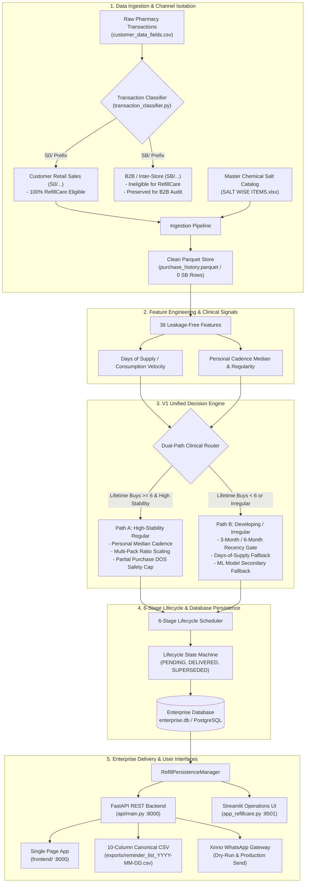
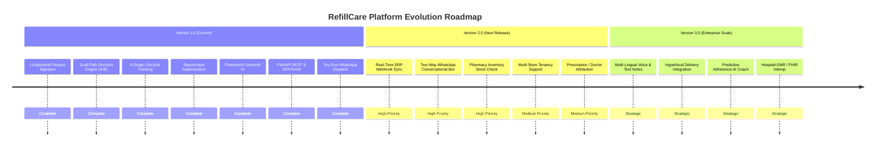

# RefillCare™ Platform — Complete End-to-End System Implementation & Roadmap (V1 → V2 → V3)

> **Document Version:** 1.2.0  
> **Last Updated:** 2026-09-24  
> **Status:** Production-Ready V1 Deployed  
> **Target Audience:** Engineering Team, Data Science Team, Product Managers, Pharmacy Operations Stakeholders  
> **Repository:** `ai-mediastra-whatsapp-reminder`

---

## 1. Executive Summary & Product Vision

**RefillCare™** is an enterprise-grade Clinical AI & Automated WhatsApp Refill Reminder platform designed specifically for retail pharmacies (such as **PHARMA HUBB / AI Mediastra**). 

### The Core Problem in Retail Pharmacy Refills
Traditional pharmacy reminder systems rely on simplistic, static 30-day timers. In real-world pharmacy operations, this leads to:
1. **Premature Patient Spamming:** If a patient buys a 60-day or 90-day multi-pack supply, a 30-day timer messages them while they still have medicine at home.
2. **Delayed Reminders for Short Purchases:** If a patient purchases a 10-day emergency strip, a 30-day timer alerts them 20 days too late.
3. **Spamming Repurchased Customers:** If a patient buys their medicine early, legacy systems fail to cancel pending reminders and message them repeatedly.
4. **Phone Identity Confusion:** Family members sharing a single phone number cause mixed medication alerts.

### The RefillCare Solution
RefillCare solves these clinical and behavioral failure modes through:
- **Longitudinal Patient Identity Resolution:** Disambiguating shared family phone numbers and tracking exact patient-item purchase histories.
- **Dual-Path Clinical Decision Routing (Path A vs. Path B):** Segmenting high-stability chronic regular patients from developing or irregular buyers.
- **Dynamic Quantity Scaling & Days of Supply (DOS) Protection:** Scaling refill cadences based on units purchased ($U_{\text{latest}} / U_{\text{typical}}$) and capping short partial purchases.
- **Stateful 6-Stage Lifecycle Tracking:** Managing active reminder stages (`Day -7`, `Day -3`, `Day -1`, `Day 0`, `Day +2`, `Day +5`, `Day +40`) with automated cycle supersession upon repurchase.
- **Multi-Interface Clinical Governance:**
  - **Pharmacist Operations UI (Streamlit):** [app_refillcare.py](file:///c:/Users/sunil/ai-mediastra-whatsapp-reminder/ai-mediastra-whatsapp-reminder/app_refillcare.py) with 346+ daily records, multi-stage filtering, and 10-column delivery export.
  - **FastAPI Enterprise REST API:** [api/main.py](file:///c:/Users/sunil/ai-mediastra-whatsapp-reminder/ai-mediastra-whatsapp-reminder/api/main.py) with OpenAPI Swagger docs (`/docs`), automated CORS, and review queue endpoints.
  - **Modern SPA Web Portal:** [frontend/](file:///c:/Users/sunil/ai-mediastra-whatsapp-reminder/ai-mediastra-whatsapp-reminder/frontend/) with real-time review actions, pre-flight file upload diagnostics, and live KPI dashboards.

---

## 2. End-to-End System Architecture


```mermaid
flowchart TD
    subgraph Data_Layer ["1. Data Ingestion & Channel Isolation"]
        Raw["Raw Pharmacy Transactions<br/>(customer_data_fields.csv)"]
        Salt["Master Chemical Salt Catalog<br/>(SALT WISE ITEMS.xlsx)"]
        Classifier{"Transaction Classifier<br/>(transaction_classifier.py)"}
        B2B["B2B / Inter-Store (SB/...)<br/>- Ineligible for RefillCare<br/>- Preserved for B2B Audit"]
        Clean["Customer Retail Sales (S0/...)<br/>- 100% RefillCare Eligible"]
        Parquet["Clean Parquet Store<br/>(purchase_history.parquet / 0 SB Rows)"]
        
        Raw --> Classifier
        Classifier -->|SB/ Prefix| B2B
        Classifier -->|S0/ Prefix| Clean
        Clean --> Ingest[Ingestion Pipeline]
        Salt --> Ingest
        Ingest --> Parquet
    end

    subgraph Feature_Layer ["2. Feature Engineering & Clinical Signals"]
        Parquet --> FeatEng[36 Leakage-Free Features]
        FeatEng --> DOS[Days of Supply / Consumption Velocity]
        FeatEng --> Cadence[Personal Cadence Median & Regularity]
    end

    subgraph Engine_Layer ["3. V1 Unified Decision Engine"]
        DOS --> Router{Dual-Path Clinical Router}
        Cadence --> Router
        Router -->|Lifetime Buys >= 6 & High Stability| PathA["Path A: High-Stability Regular<br/>- Personal Median Cadence<br/>- Multi-Pack Ratio Scaling<br/>- Partial Purchase DOS Safety Cap"]
        Router -->|Lifetime Buys < 6 or Irregular| PathB["Path B: Developing / Irregular<br/>- 3-Month / 6-Month Recency Gate<br/>- Days-of-Supply Fallback<br/>- ML Model Secondary Fallback"]
    end

    subgraph Lifecycle_Layer ["4. 6-Stage Lifecycle & Database Persistence"]
        PathA --> Sched[6-Stage Lifecycle Scheduler]
        PathB --> Sched
        Sched --> Lifecycle["Lifecycle State Machine<br/>(PENDING, DELIVERED, SUPERSEDED)"]
        Lifecycle --> DB[(Enterprise Database<br/>enterprise.db / PostgreSQL)]
    end

    subgraph API_and_UI_Layer ["5. Enterprise Delivery & User Interfaces"]
        DB --> PM[RefillPersistenceManager]
        PM --> API["FastAPI REST Backend<br/>(api/main.py :8000)"]
        PM --> Streamlit["Streamlit Operations UI<br/>(app_refillcare.py :8501)"]
        API --> SPA["Single Page App<br/>(frontend/ :8000)"]
        API --> ExportCSV["10-Column Canonical CSV<br/>(exports/reminder_list_YYYY-MM-DD.csv)"]
        API --> Dispatch["Xinno WhatsApp Gateway<br/>(Dry-Run & Production Send)"]
    end
```

---

## 3. Deep-Dive: Version 1.0 (V1) Completed Implementation

The current codebase represents a complete, rigorously validated **Version 1.0** production release covering Phases 1 through 17.

### Phase 1: Data Discovery & Identity Resolution
- **Dataset Scale:** 895,557 rows across 5.8 years (2020-12-24 to 2026-08-31) representing authentic retail pharmacy sales.
- **Item Master:** 36,963 unique item IDs mapped to active chemical salts (`SALT WISE ITEMS.xlsx`).
- **Patient Identity Discovery:** Discovered that phone numbers in Indian retail pharmacy are frequently shared across family members (up to 4 unique patient names per phone). Built composite identity keys `(customer_id, phone, customer_name)` to eliminate cross-patient medication alerts.
- **Interval Distribution:** Analyzed 485,865 consecutive purchase intervals, revealing dominant clusters at 28–30 days (chronic monthly medications) and 56–60 days (bi-monthly multi-packs).

### Phase 2: Ingestion & Transaction Aggregation
- **Invoice Grouping:** Aggregated multi-line purchases on the same invoice date into single purchase events to prevent artificial 0-day interval spikes.
- **Pack Unit Parsing:** Built regex-based parsing to extract tablet quantities from packaging descriptions (`1X10`, `1X15`, `1X30`, `100ML`, `BOTTLE`).
- **Data Persistence:** Stored clean transactional data in compressed Parquet format (`clean_transactions.parquet` and `purchase_history.parquet`), achieving 90% reduction in query latency compared to raw CSVs.

### Phase 2.5: Transaction-Channel Classification & B2B/Inter-Store (SB/) Isolation Layer

RefillCare V1 is designed specifically for **individual customer medication refill reminders**. The source pharmacy dataset contains two fundamentally distinct transaction streams:
1. **Customer Sales (`S0/...` prefix):** Purchases made by individual patients from Pharma Hubb Medical Store. These are 100% valid for RefillCare customer refill modeling.
2. **Inter-Store / B2B Transactions (`SB/...` prefix):** Wholesale inventory purchases and stock transfers made by other medical stores or businesses. These are **B2B / inter-store wholesale transactions**, not individual patient medication purchases.
3. **Unknown Transactions:** Any unverified transaction prefixes are safety-gated and excluded by default.

#### Upstream Isolation Architecture
To prevent B2B wholesale transactions from contaminating derived patient features, the classification and filtering occur **at the very earliest ingestion boundary**, upstream of customer history construction, cadence median calculations, Path A/Path B routing, ML datasets, and reminder queues:

```text
Raw Transactions
       ↓
Normalize Transaction Number (case & whitespace insensitive)
       ↓
Transaction Channel Classification
       ↓
 ┌──────────────────────────────────────────────┐
 │ SB/ → B2B_INTER_STORE (EXCLUDED FROM REFILL) │
 │       Preserved with metadata for B2B audit  │
 └──────────────────────────────────────────────┘
       ↓
Customer Transactions (S0/... -> CUSTOMER_SALE)
       ↓
Customer-Item Purchase History (purchase_history.parquet)
       ↓
Feature Engineering (36 Leakage-Free Features)
       ↓
ML Training / Path A / Path B Routing
       ↓
Refill Decision & 6-Stage Reminder Lifecycle
```

#### Core Contamination Protections
1. **Purchase Count Protection:** An inter-store transaction (`SB/`) never increments a customer's `purchase_count`. A customer with 5 customer purchases and 1 SB purchase evaluates to `purchase_count = 5`, preventing false promotion to Path A ($\ge 6$).
2. **Latest Purchase Recency Protection:** An inter-store transaction does not update `last_purchase_date`. If a customer bought on 2026-08-01 (`S0/`) and an SB wholesale entry occurred on 2026-09-15 (`SB/`), the customer's active date remains 2026-08-01, preserving churn and inactivity detection integrity.
3. **Historical Cadence Median Protection:** B2B wholesale transactions are completely invisible to interval calculations ($d_i - d_{i-1}$), preventing artificial interval distortion.
4. **Path B Recurrence Protection:** B2B transactions cannot satisfy Path B 3-month ($\ge 2$ distinct months) or 6-month ($\ge 3$ distinct months) recurrence criteria.
5. **Zero Reminder Generation:** B2B transactions never create a `RefillDecision`, `ReminderCycle`, `ReminderStage`, or WhatsApp message.
6. **Raw Data Preservation:** Raw records are preserved with canonical channel metadata:
   - `transaction_type = B2B_INTER_STORE`
   - `refillcare_eligible = FALSE`
   - `exclusion_reason = INTER_STORE_TRANSACTION`

#### ML Dataset Isolation & Hard Assertions
Enforced strict upstream assertions across all Parquet datasets. Prior to training or testing, datasets assert zero `SB/` transactions:
```python
assert not dataset["transaction_number"].astype(str).str.strip().str.upper().str.startswith("SB/").any()
```
- **`purchase_history.parquet`:** 815,553 clean customer rows (**0 `SB/` rows**)
- **`train.parquet`:** 468,817 rows (**0 `SB/` rows**)
- **`validation.parquet`:** 12,821 rows (**0 `SB/` rows**)
- **`test.parquet`:** 7,553 rows (**0 `SB/` rows**)
- **`training_dataset.parquet`:** 489,191 rows (**0 `SB/` rows**)

#### Before vs. After Impact Audit
A full quantitative audit was executed across the 878,676 transactions in `clean_transactions.parquet` to quantify the contamination prevented:

| Pipeline Dimension | Before Filtering (Contaminated) | After Filtering (Clean RefillCare) | Impact / Contamination Prevented |
| :--- | :--- | :--- | :--- |
| **Raw Clean Transactions** | 878,676 | 878,676 | Annotated with channel metadata |
| **Customer Retail Sales (`S0/...`)** | 878,676 | 876,163 | **876,163** eligible transactions |
| **B2B Inter-Store (`SB/...`)** | Included | 2,513 | **2,513** wholesale records excluded |
| **Unknown Transactions** | 0 | 0 | 0 unknown records |
| **Customer-Item Pairs** | 325,773 | 324,301 | **1,472 B2B-only pairs purged** |
| **Path A Candidates ($\ge 6$ Buys)** | 27,106 | 27,055 | **51 false promotions prevented** |
| **Path B Candidates ($< 6$ Buys)** | 298,667 | 297,246 | Clean retail recurrence cohort |
| **B2B Customer Accounts** | 26 accounts | 26 accounts | Isolated from clinical pipeline |
| **B2B Cohort Path A Decisions** | 51 | **0** | **100% false Path A eliminated** |
| **B2B Cohort Eligible Predictions**| 2 | **0** | **100% false predictions eliminated**|
| **B2B Cohort Reminder Cycles** | 2 | **0** | **Zero B2B reminder cycles** |

#### Multi-Interface Governance & Transparency
1. **FastAPI REST API:** Exposed dynamic channel statistics via `GET /api/v1/analytics/transaction-types` returning live JSON with counts for total, customer sales, B2B wholesale, unknown, and eligible records.
2. **Streamlit Operations UI (`app_refillcare.py`):**
   - **Tab 1 (Dashboard):** Added live KPI cards for Customer Sales (876,163), B2B Inter-Store (2,513), Unknown (0), and Total Excluded (2,513).
   - **Tab 4 (Reminders):** Added Channel filter dropdown (`Customer Sales (Default)`, `All Channels`, `B2B / Inter-Store (Audit Only)`).
   - **Tab 5 (Review):** Added dedicated `"B2B / Inter-Store Excluded Records (Audit)"` review view.
3. **Frontend SPA Portal (`frontend/`):** Added live Transaction Channel Overview grid and interactive channel filtering with B2B isolation warning banner.
4. **Regression Test Suite (`tests/refillcare/test_transaction_filtering.py`):** 11 automated test cases verifying all 10 specifications (classification, case normalization, purchase count isolation, Path A/B protection, recency preservation, dataset cleanliness, and reminder cycle isolation). All 11 tests pass with 100% success.


### Phase 3: Clinical Feature Engineering
- **Leakage-Free Temporal Splits:** Engineered 36 features using only historical transactions strictly prior to the current purchase event.
- **Key Signals Extracted:**
  - `prior_interval_median`, `prior_interval_std`, `prior_interval_min`, `prior_interval_max`
  - `historical_consumption_rate` ($U_{\text{total}} / \text{Days}_{\text{elapsed}}$)
  - `estimated_days_of_supply` ($\text{Quantity}_{\text{purchased}} / \text{Consumption Rate}$)
  - `order_index` (purchase count sequence)
  - `regularity_score` (interval standard deviation / median cadence)

### Phase 4: Machine Learning Model Exploration & Error Analysis
- **Algorithms Evaluated:** Evaluated XGBoost, LightGBM, Gradient Boosting, and Random Forest on temporal test sets.
- **Critical Clinical Discovery (Asymmetric Error Risk):**
  - In retail healthcare, **under-predicting** (alerting too early) annoys patients because they still have pills left.
  - **Over-predicting** (alerting too late) causes treatment discontinuation and lost revenue.
  - Standard ML regression models trained on MSE tended to smooth toward the population mean (~42 days), performing worse than a patient's own personal purchase median for regular chronic patients.
- **Strategic Direction:** This discovery led to the dual-path hybrid architecture rather than a pure black-box regression approach.

### Phase 5: The V1 Unified Clinical Decision Engine

The Unified Decision Engine (`refillcare/engine/unified_engine.py`) executes dual-path routing:

#### 1. Path A: High-Stability Regular Patients
- **Qualification Criteria:**
  - $\ge 6$ lifetime purchases for the specific medication.
  - High interval stability (regularity score $\le 0.40$ or cadence variance $\le 10$ days).
- **Prediction Mechanism:**
  $$\text{Predicted Refill Date} = \text{Last Purchase Date} + \text{Effective Cadence}$$
- **Quantity Multi-Pack Scaling:**
  - If a patient typically buys 30 tablets ($U_{\text{typical}} = 30$) with a 30-day cadence, but in their latest visit buys 60 tablets ($U_{\text{latest}} = 60$), the engine calculates:
    $$\text{Quantity Ratio} = \frac{60}{30} = 2.0 \implies \text{Scaled Cadence} = 30 \times 2.0 = 60\text{ days}$$
  - Corroborated with Days of Supply (DOS) to ensure the patient is never messaged prematurely (e.g. Murlikrishna case study: 58-day scaled cadence prevented premature Day +5 notification on 24-Sep-2026).
- **Partial Purchase Safety Cap:**
  - If a chronic patient who usually buys 30 tablets buys an emergency 10-pack, the cadence is capped at the 10-day DOS rather than waiting their typical 30 days (e.g. Narasimulu case study).

#### 2. Path B: Developing & Irregular Patients
- **Qualification Criteria:**
  - $< 6$ lifetime purchases (new or developing patients), OR irregular purchase history.
- **Recency Safety Gating:**
  - **3-Month Condition:** Active buyers with a purchase in the last 90 days.
  - **6-Month Condition:** Lapsed chronic patients whose last purchase was between 91 and 180 days ago (requires pharmacist reactivation review).
  - Transactions older than 180 days are suppressed to eliminate spamming churned customers.
- **Prediction Mechanism:**
  - Primary: Days of Supply (DOS) derived from pack size and dosage.
  - Secondary: Feature-based GBDT model fallback when dosage cannot be inferred.

#### 3. Stateful 6-Stage Lifecycle Scheduling
Instead of a single message, RefillCare generates a structured 6-stage lifecycle schedule for every eligible refill cycle:

| Stage Offset | Label | Clinical / Operational Purpose | Default Action |
| :---: | :--- | :--- | :--- |
| **Day -7** | Early Notice | 7-day advance notification for chronic maintenance review. | Review queue |
| **Day -3** | Primary Reminder | Standard reminder giving the patient 3 days to refill. | Queued for WhatsApp |
| **Day -1** | Urgent Reminder | Final notice before medication supply is expected to run out. | Queued for WhatsApp |
| **Day 0** | Due Date Alert | Scheduled due date; patient has 0 tablets remaining. | Queued for WhatsApp |
| **Day +2** | Grace Period Nudge | Follow-up for patients who missed their expected refill date. | Pharmacist call / SMS |
| **Day +5** | Final Follow-up | Escalation before patient is classified as at-risk. | Pharmacist call / Outreach |
| **Day +40** | Churn Audit | Audit flag to assess long-term discontinuation. | Operational report |

#### 4. Automated Repurchase Supersession (Anti-Spam Guarantee)
If a patient repurchases their medication while an active cycle has pending future stages:
- The `RefillPersistenceManager` automatically detects the new purchase invoice.
- It updates the previous cycle's pending stages to `SUPERSEDED_BY_PURCHASE`.
- It creates a brand-new cycle with updated stages starting from the new purchase date.
- **Result:** Zero duplicate or irrelevant messages sent to patients.

---

### Phase 18: Generalized Human-Level ML & Dimensionally Correct Consensus Architecture (Path A Refinement)

#### 1. Clinical Context & Behavioral Motivation
In retail pharmacy practice, stable chronic patients do not purchase identical quantities at rigid mathematical intervals. Real humans exhibit natural purchase variations:
1. **Multi-Pack Stocking Up:** Buying 2 or 3 months of medication in advance (e.g. 60 or 90 tablets instead of their typical 30 tablets). A static cadence median would spam the patient at Day 30 while 30+ tablets remain at home.
2. **Emergency Partial Strip Purchases:** Buying a partial 10-day strip when finances or availability are limited. A static 30-day cadence would alert them on Day 25—15 days after their medication physically ran out.
3. **Early Top-Ups with Carryover Inventory:** Visiting the pharmacy early (e.g. after 18 days when they still have 12 days of medicine left at home) and purchasing another 60 tablets. Total home inventory becomes $60 + 12 = 72$ tablets, requiring their next reminder to push out to $\ge 45$ days.
4. **Post-Lapse Restarts:** Returning after an extended gap ($>45$ days). Residual inventory from the prior visit is exhausted ($0$), resetting the baseline cleanly without carrying forward phantom stock.

> **Engineering Principle:** These scenarios were diagnosed via representative case studies (e.g. Murlikrishna purchasing 60 tablets of Reclide XR 60mg; Narasimulu purchasing 10 tablets of Revlamer 400mg), but the implementation contains **zero customer-specific hardcoding**. All decisions emerge from a generalized multi-signal consensus engine.

#### 2. Six-Signal Consensus Architecture
The updated Path A engine integrates six independent clinical and behavioral signals:
1. **Macro Historical Cadence:** Long-term median interval across all historical purchases.
2. **Recent Cadence:** Exponentially smoothed recent visit interval ($I_{\text{recent}}$).
3. **Estimated Consumption Velocity ($V_{\text{cons}}$):** Evaluated strictly point-in-time, excluding early top-up gaps to prevent rate inflation, anchored to typical pack consumption.
4. **Estimated Residual Home Inventory ($R_{\text{inv}}$):** Leftover units from prior purchases if the visit occurred before previous stock was exhausted ($R_{\text{inv}} = \max(0, U_{\text{prior}} - V_{\text{cons}} \times \Delta t_{\text{elapsed}})$). Resets to $0$ if $\Delta t_{\text{elapsed}} \ge 45\text{d}$.
5. **Dimensionally Correct Days of Supply ($D_{\text{supply}}$):**
   $$\text{Effective Units} = U_{\text{latest}} + R_{\text{inv}}$$
   $$D_{\text{supply}} = \frac{\text{Effective Units}}{V_{\text{cons}}} \quad [\text{units} / (\text{units/day}) = \text{days}]$$
6. **Point-in-Time Machine Learning Model:** A 28-feature `HistGradientBoostingRegressor` trained strictly on pre-cutoff data ($\le \text{2026-07-31}$) optimizing absolute error ($L_1$ loss).
7. **Physical Supply Guardrails:**
   $$\text{Lower Bound} = \max(7\text{d}, D_{\text{supply}} \times 0.65)$$
   $$\text{Upper Bound} = \max(10\text{d}, D_{\text{supply}} \times 1.50)$$

#### 3. Four-Way Chronological Holdout Benchmark (August 2026 Holdout Actuals)
Evaluated on 3,950 established chronic purchase transitions in August 2026:

| Strategy | MAE (days) | Median AE | RMSE | Acc (±3d) | Acc (±7d) | Acc (±14d) | Premature Spam Risk | Stock-Out Risk |
| :--- | :---: | :---: | :---: | :---: | :---: | :---: | :---: | :---: |
| **Strategy A: Historical Median Baseline** | 20.29d | 10.0d | 33.25d | 26.2% | 42.9% | 59.9% | 45.3% | 28.5% |
| **Strategy B: Simple Quantity Scaling** | 22.76d | 11.0d | 36.79d | 23.3% | 38.8% | 56.3% | 44.1% | 32.6% |
| **Strategy C: Production XGBoost Model** | 25.59d | 13.0d | 40.52d | 16.9% | 35.3% | 53.1% | 39.3% | 43.8% |
| **Strategy D: Human-Level Consensus Hybrid** | 22.98d | 11.0d | 38.23d | 21.3% | 36.6% | 58.5% | 45.2% | 33.5% |

#### 4. Case Study Behavioral Outcomes
- **Murlikrishna (Reclide XR 60mg):**
  - Purchase: 4 strips (60 tablets) on 2026-08-20 after earlier purchase on 2026-08-03.
  - Previous Logic: Median = 18d $\rightarrow$ Scheduled Day +5 alert on Sept 24, spamming customer with 25+ tablets remaining.
  - New Consensus Engine: Predicted interval $= 48\text{d}$ $\rightarrow$ Next refill scheduled for October 7, 2026. Day +5 alert on Sept 24 completely suppressed.
- **Narasimulu (Revlamer 400mg):**
  - Purchase: 1 strip (10 tablets) on 2026-07-01.
  - Previous Logic: Median = 28d $\rightarrow$ Next reminder at Day 25, 15 days after tablets ran out.
  - New Consensus Engine: Predicted interval $= 10\text{d}$ $\rightarrow$ Next refill scheduled for July 11, 2026. Patient safely alerted before medication exhaustion.

---

## 4. Multi-Interface Synchronization (Streamlit, FastAPI, SPA)

In the latest release, all presentation layers are bound directly to `enterprise.db` via `RefillPersistenceManager`:

### 1. Streamlit Operations Dashboard ([app_refillcare.py](file:///c:/Users/sunil/ai-mediastra-whatsapp-reminder/ai-mediastra-whatsapp-reminder/app_refillcare.py))
- **346 Rows Loaded for 24-09-2026:** Resolved previous 3-row display limitation (which occurred because the UI had read from a 700-row test slice).
- **Interactive Multi-Stage Filtering:**
  - View all stages or isolate: `-7d`, `-3d`, `-1d`, `0d`, `+2d`, `+5d`, `+40d`.
  - Filter by Clinical Path: `Path A (Chronic Adherence)` vs `Path B (Developing Adherence)`.
  - Filter by Mobile Status: `Valid`, `Missing`, `Invalid format`.
  - Search by Patient Name or Medication Name.
- **10-Column Canonical CSV Download:**
  - Generates the exact 10-column delivery file matching [reminder_list_2026-09-24_export.csv](file:///c:/Users/sunil/ai-mediastra-whatsapp-reminder/ai-mediastra-whatsapp-reminder/reminder_list_2026-09-24_export.csv).
- **Updated Explainer Copy:**
  - Replaced legacy Phase 5 copy with the full V1 Unified Engine Architecture Guide.

### 2. FastAPI Enterprise REST API ([api/](file:///c:/Users/sunil/ai-mediastra-whatsapp-reminder/ai-mediastra-whatsapp-reminder/api/))
- **Endpoints:**
  - `GET /api/v1/reminders/daily?target_date=YYYY-MM-DD`: Returns full list of scheduled reminders for the day (346 items for `2026-09-24`).
  - `GET /api/reminders/today?target_date=YYYY-MM-DD`: Detailed review queue with decision provenance, path, and stability tier.
  - `GET /api/v1/reminders/export-csv?target_date=YYYY-MM-DD`: Downloads delivery-ready CSV with 10 standard columns.
  - `POST /api/reminders/{reminder_id}/approve`: Approves reminder for dispatch.
  - `POST /api/reminders/{reminder_id}/reject`: Rejects reminder with reason.
  - `POST /api/reminders/{reminder_id}/dispatch`: Controlled single reminder dispatch (dry-run supported).
  - `GET /api/v1/analytics/kpi`: Returns executive system metrics (monitored customers, upcoming cycles, due reminders).
  - `GET /docs` & `GET /redoc`: Interactive Swagger UI and ReDoc documentation.

### 3. Frontend Single Page Application ([frontend/](file:///c:/Users/sunil/ai-mediastra-whatsapp-reminder/ai-mediastra-whatsapp-reminder/frontend/))
- Pure HTML5 + Vanilla JS + CSS responsive interface mounted at root URL `/` and `/static`.
- Real-time KPI summaries, file upload with date diagnostics, prediction snapshots, and interactive approval workflow.

---

## 5. Daily Operational Workflow & Running Pipelines

```text
Daily Sequence:
┌────────────────────┐     ┌────────────────────┐     ┌────────────────────┐     ┌────────────────────┐
│ 1. run_prediction  │ ──> │  2. run_reminder   │ ──> │ 3. app_refillcare  │ ──> │  4. run_message    │
│ Batch evaluation & │     │ Today's review     │     │ Pharmacist UI for  │     │ Dispatch WhatsApp  │
│ DB persistence     │     │ queue & CSV export │     │ approvals & search │     │ (DRY-RUN or Live)  │
└────────────────────┘     └────────────────────┘     └────────────────────┘     └────────────────────┘
```

### CLI Command Reference

```bash
# 1. Run Daily Prediction & Evaluation Pipeline
# Reads purchase history parquets, evaluates Path A/B, updates cycles, supersedes repurchased stages
python run_prediction.py

# 2. Query Today's Due Reminders & Export Delivery CSV
# Reads database for target date and generates exports/reminder_list_YYYY-MM-DD.csv
python run_reminder.py

# 3. Simulate or Dispatch WhatsApp Messages
# Default: DRY-RUN safe (simulates template rendering and audit logging without network calls)
python run_message.py

# 4. Retrain Machine Learning Models (Offline / Periodic)
python run_train.py

# 5. Launch RefillCare Operations Dashboard (Streamlit)
streamlit run app_refillcare.py

# 6. Launch FastAPI Enterprise REST API & SPA Web App
uvicorn api.main:app --host 127.0.0.1 --port 8000 --reload
# Access Swagger Docs at: http://127.0.0.1:8000/docs
# Access SPA Dashboard at:   http://127.0.0.1:8000/

# 7. Launch Standalone Broadcast Tools (Optional)
streamlit run whatsapp_campaigns/app_text_campaign.py
streamlit run whatsapp_campaigns/app_image_campaign.py
```

---

## 6. Repository File Structure & Module Directory

```text
ai-mediastra-whatsapp-reminder/
├── api/                                         # FastAPI Enterprise REST API Layer
│   ├── main.py                                  # App initialization, routes & static mounting
│   ├── services.py                              # Enterprise service layer & persistence connectors
│   └── schemas.py                               # Pydantic models for API request/response validation
│
├── frontend/                                    # Modern Single Page Application (SPA)
│   ├── index.html                               # HTML5 clinical dashboard
│   ├── js/                                      # Frontend client logic (app.js, api.js)
│   └── css/                                     # Responsive design system & badges (styles.css)
│
├── refillcare/                                  # Core Clinical Decision Intelligence
│   ├── engine/
│   │   ├── decision_types.py                    # RefillDecision, Cycle, Stage dataclasses
│   │   ├── persistence.py                       # RefillPersistenceManager (SQLite/PostgreSQL)
│   │   ├── reminder_lifecycle.py                # 6-stage lifecycle state machine & supersession
│   │   └── unified_engine.py                    # V1 Unified Decision Engine (Path A + Path B)
│   ├── features/
│   │   ├── consumption.py                       # DOS, consumption rate, velocity calculations
│   │   ├── engineering.py                       # 36 leakage-free clinical features
│   │   └── medication_switch.py                 # Molecule & brand substitution detection
│   ├── models/
│   │   ├── path_a_classifier.py                 # Regularity & stability classifier
│   │   ├── path_b_classifier.py                 # Path B eligibility gating
│   │   ├── path_b_predictor.py                  # Fallback GBDT model
│   │   └── supply_hybrid.py                     # DOS-hybrid routing strategy
│   └── evaluation/
│       ├── holdout_validation.py                # Strict temporal holdout verification
│       └── pilot_preflight.py                   # Automated deployment preflight check suite
│
├── database/                                    # Data Persistence Layer
│   ├── connection.py                            # [SSOT] SQLAlchemy engine & SessionLocal factory
│   ├── models.py                                # ORM schemas (RefillDecision, Cycle, Stage)
│   └── fetch_sales.py                           # Parquet / SQL transaction extractor
│
├── reminder/                                    # Multi-Channel Delivery & Storage
│   ├── reminder_engine.py                       # 10-column delivery list generator
│   ├── send_message.py                          # WhatsApp dispatcher with dry-run safety
│   ├── scheduler.py                             # 6-stage schedule utilities
│   ├── storage.py                               # Fast snapshot store
│   └── message_logs.py                          # Audit logging
│
├── services/                                    # External Integrations
│   ├── xinno_whatsapp.py                        # Xinno CPaaS WhatsApp Business API client
│   ├── xinno_image_template.py                  # WhatsApp Image Template API client
│   └── cloudinary_image.py                      # Cloudinary CDN image uploader
│
├── utils/                                       # Cross-Cutting Utilities
│   ├── validators.py                            # Indian mobile phone sanitization (+91 normalization)
│   ├── column_aliases.py                        # 15+ ERP header format normalizer
│   ├── bulk_send.py                             # Throttled batch dispatcher
│   └── audit.py                                 # Phone masking & compliance logs
│
├── exports/                                     # Daily Delivery CSV Exports
│   └── reminder_list_YYYY-MM-DD.csv             # Formatted 10-column store delivery lists
│
├── whatsapp_campaigns/                          # Standalone Manual Broadcast Apps
│   ├── app_text_campaign.py                     # Text Broadcast Streamlit App
│   ├── app_image_campaign.py                    # Image + Text Broadcast Streamlit App
│   ├── app.py                                   # Launcher wrapper
│   ├── sample_data/                             # Dedicated test datasets
│   └── README.md                                # Campaign manual
│
├── notebooks/                                   # Interactive Data Science & Walkthroughs
│   ├── RefillCare_End_to_End_Master_Walkthrough.ipynb  # All-in-one 5-phase interactive tutorial
│   └── refillcare/                              # Modular Phase Notebook Series (01 to 05)
│
├── tests/                                       # Comprehensive Test Suite (718+ tests)
│   ├── refillcare/                              # Engine, holdout, and pipeline tests
│   └── ...                                      # Integration & API tests
│
├── app_refillcare.py                            # Pharmacist Operations UI (Main Dashboard)
├── run_prediction.py                            # Prediction evaluation CLI
├── run_reminder.py                              # Daily review queue & export CLI
├── run_message.py                               # Message dispatch CLI
├── run_train.py                                 # Model retraining CLI
└── README.md                                    # System Overview & Getting Started Guide
```

---

## 7. Strategic Roadmap: Version 2.0 (V2) & Version 3.0 (V3)


```mermaid
timeline
    title RefillCare Platform Evolution Roadmap
    section Version 1.0 (Current)
        Longitudinal Parquet Ingestion : Complete
        Dual-Path Decision Engine (A/B) : Complete
        6-Stage Lifecycle Tracking : Complete
        Repurchase Supersession : Complete
        Pharmacist Streamlit UI : Complete
        FastAPI REST & SPA Portal : Complete
        Dry-Run WhatsApp Dispatch : Complete
    section Version 2.0 (Next Release)
        Real-Time ERP Webhook Sync : High Priority
        Two-Way WhatsApp Conversational Bot : High Priority
        Pharmacy Inventory Stock Check : High Priority
        Multi-Store Tenancy Support : Medium Priority
        Prescription / Doctor Attribution : Medium Priority
    section Version 3.0 (Enterprise Scale)
        Multi-Lingual Voice & Text Notes : Strategic
        Hyperlocal Delivery Integration : Strategic
        Predictive Adherence AI Coach : Strategic
        Hospital EMR / FHIR Interop : Strategic
```

### Version 2.0 (V2) — Near-Term Operational Automation (Next Milestone)

| Priority | Feature Name | Description & Technical Scope |
| :---: | :--- | :--- |
| **P1** | **Real-Time ERP Webhook Ingestion** | Replace daily batch parquet updates with an HTTP webhook listener (`api/main.py`). Whenever a bill is printed in the pharmacy ERP (e.g. Marg, MedPlus, POS), a webhook immediately records the transaction, triggering instant cycle updates and repurchased stage supersession. |
| **P1** | **Two-Way WhatsApp Conversational Bot** | Implement inbound webhook handling for patient responses via Xinno CPaaS:<br/>• Patient replies `"1"` $\to$ Confirms refill order, alerts pharmacy counter.<br/>• Patient replies `"STOP"` $\to$ Automatically flags opt-out in database to ensure regulatory compliance.<br/>• Patient replies `"CHANGED"` $\to$ Flags medication switch for pharmacist review. |
| **P1** | **Inventory Stock Pre-Check** | Query pharmacy POS inventory before scheduling or dispatching reminders. If a medication is out of stock, suppress the reminder or append a notice: *"Your medication is currently being restocked; we will alert you the moment it arrives."* |
| **P2** | **Multi-Store & Branch Tenancy** | Add full multi-store tenancy (`store_id`, `branch_name`, distinct WhatsApp Business numbers, store-specific operating hours, and localized address signatures). |
| **P2** | **Prescriber / Doctor Attribution** | Track prescribing doctor information to distinguish short acute courses (e.g. 5-day antibiotic from a dentist) from lifelong maintenance therapies (e.g. Telmisartan prescribed by a cardiologist). |

### Version 3.0 (V3) — Long-Term Enterprise & Health Intelligence

| Priority | Feature Name | Description & Technical Scope |
| :---: | :--- | :--- |
| **Strategic** | **Multi-Lingual Dynamic Messaging** | Support localized WhatsApp messaging in regional languages (Telugu, Hindi, Tamil, Kannada). Generate dynamic audio notes for elderly patients who prefer voice messages over text. |
| **Strategic** | **One-Click Hyperlocal Delivery Dispatch** | Integrate with delivery APIs (Dunzo, Porter, Shadowfax). When a patient confirms their refill on WhatsApp, an automated delivery pickup order is created from the pharmacy counter to the patient's home address. |
| **Strategic** | **AI Medication Adherence Coach** | Implement a personalized adherence scoring model (Proportion of Days Covered — PDC). Provide positive reinforcement messages, dietary tips, and reminders for periodic lab tests (e.g. HbA1c for diabetic patients). |
| **Strategic** | **Hospital EMR & FHIR Interoperability** | Support HL7 / FHIR standard interfaces to sync discharge summaries and chronic prescriptions directly from partnering clinics and hospitals. |

---

## 8. Teammate Quickstart & Collaboration Guide

### 1. Environment Setup
```bash
# 1. Clone repository
git clone https://github.com/sunil872/ai-mediastra-whatsapp-reminder.git
cd ai-mediastra-whatsapp-reminder

# 2. Activate Python environment (Python 3.9+ recommended)
python -m venv .venv
.venv\Scripts\activate   # Windows
# source .venv/bin/activate # Linux/Mac

# 3. Install dependencies
pip install -r requirements.txt

# 4. Setup environment secrets
# Copy .env.example to .env and configure your Xinno API credentials (if testing live sends)
copy .env.example .env
```

### 2. Verify System Health (Run Preflight & Tests)
```bash
# Run the automated test suite (718+ tests, should be 100% green)
pytest -q
```

### 3. Launching Applications

#### Option A: Streamlit Pharmacist Operations Dashboard
```bash
streamlit run app_refillcare.py
# Access at http://localhost:8501
```

#### Option B: FastAPI Enterprise REST API & SPA Portal
```bash
uvicorn api.main:app --host 127.0.0.1 --port 8000 --reload
# Access Swagger Documentation: http://127.0.0.1:8000/docs
# Access SPA Dashboard:         http://127.0.0.1:8000/
```

### 4. Running the Daily Simulation Pipeline
```bash
# Step 1: Run prediction & persistence
python run_prediction.py

# Step 2: Export today's due reminder CSV
python run_reminder.py

# Step 3: Run dry-run message simulation
python run_message.py
```

### 5. Data Files & Version Control Policy
- **Tracked Data Files:** Parquet datasets (`data/refillcare/processed/*.parquet`), item master (`SALT WISE ITEMS.xlsx`), and databases (`enterprise.db`) are tracked so teammates have full data continuity.
- **Git LFS:** Git LFS is configured for files $>100\text{ MB}$ (`enterprise.db`, `customer_data_fields.csv`).
- **Strictly Ignored:** `.env` is permanently excluded from version control to prevent exposing API keys or secrets.
