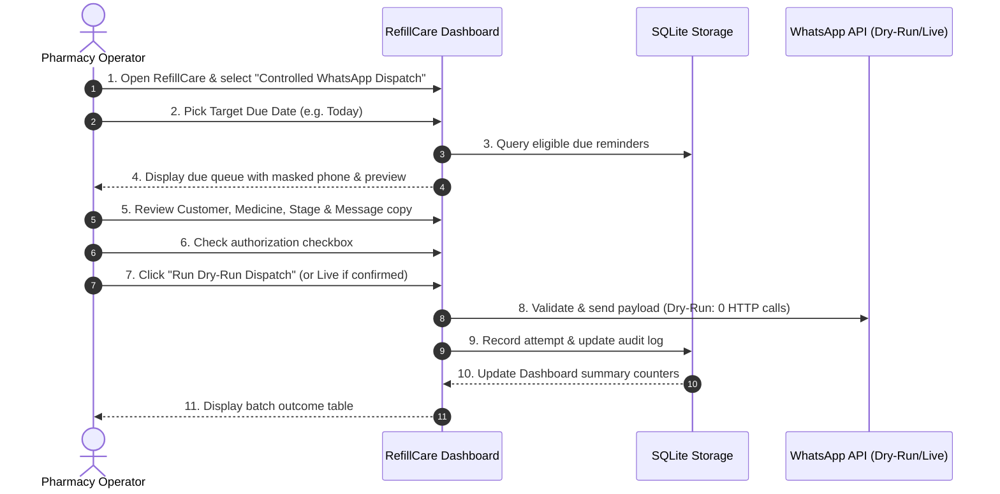

# Phase 11 — RefillCare Controlled Pilot Readiness & Operational SOP

**Project:** Medication Refill Reminder System — RefillCare  
**Date:** 2026-09-09  
**Status:** Phase 11 Complete — Controlled Pilot Preparation & Operational Readiness  

---

## 1. Executive Summary

Phase 11 transitions RefillCare from a validated prototype into an **operator-controlled, human-in-the-loop pilot system**. 

The goal of this phase is not a broadcast rollout, but establishing absolute operational clarity, safety guardrails, and explainability for pharmacy operators before contacting real patients.

### Core Pilot Principle
> **The pharmacy operator remains in full control.**
> 
> No message is sent automatically upon page load, model refresh, or filter selection. Every refill reminder candidate must be explainable, reviewable, and explicitly confirmed by a pharmacist before dispatch. Dry-run mode remains the strict default.

---

## 2. Current System State

RefillCare operates on an end-to-end verified pipeline:
- **Historical Purchase Timeline:** Canonical grouping by `(customerId, itemId)`.
- **Feature Engineering:** Leakage-safe historical expanding window metrics.
- **Model Engine:** Trained XGBoost regression pipeline predicting expected refill interval days.
- **Reminder Scheduler:** Deterministic 6-stage reminder cycle (`-7d`, `-3d`, `-1d`, `0d`, `+2d`, `+5d`).
- **Template Integration:** Approved 6-variable WhatsApp Business template (`refillcare_medicine_reminder`, Utility, `en`).
- **Storage & Audit:** Local SQLite database (`reminder_audit`) recording state transitions (`scheduled` $\to$ `sending` $\to$ `accepted` / `failed` / `cancelled`), masked phone numbers (`***1234`), and zero stored credentials.

---

## 3. Pilot Eligibility Policy

To protect patient trust and eliminate irrelevant notifications, the pilot eligibility policy enforces strict deterministic criteria:

```
+-------------------------------------------------------------------------------+
|                       PILOT ELIGIBILITY DETERMINATION MATRIX                  |
+-------------------------------------------------------------------------------+
| RULE                               | REASON                  | ACTION         |
+------------------------------------+-------------------------+----------------+
| Missing customerId or itemId       | Identity unresolvable   | Exclude        |
| Invalid/missing mobile phone       | Delivery impossible     | Exclude        |
| Purchase count < 2 (Cold Start)    | No baseline interval    | Exclude        |
| Single non-recurring acute drug    | High false-positive risk| Exclude        |
| Predicted interval <= 0 or NaN     | Nonsensical model output| Exclude        |
| Repurchase occurred recently       | Cycle reset triggered   | Cancel Old     |
| Reminder already accepted/sent     | Prevent patient spam    | Block Duplicate|
| History Quality = High / Recurring | Strong clinical signal  | Tier A Pilot   |
| History Quality = Medium           | Moderate consistency    | Tier B Review  |
| History Quality = Low (2 visits)   | Low statistical basis   | Tier C Suppress|
+-------------------------------------------------------------------------------+
```

---

## 4. Pilot Tier Classification

Every patient-medicine history is categorized into an explainable operational tier:

| Pilot Tier | Eligibility Criteria | Model Precision ($\pm 7\text{d}$) | Dispatch Queue Policy |
| :--- | :--- | :--- | :--- |
| **Tier A — Strong Pilot Candidate** | $\ge 5$ purchases OR ($\ge 3$ purchases with recurring chronic pattern) | **47.27%** ($\text{MAE}=9.64\text{d}$) | **Primary Pilot Cohort:** Displayed as priority candidates for reminder dispatch. |
| **Tier B — Review Required** | $3\text{--}4$ purchases with moderate interval consistency | **38.90%** ($\text{MAE}=13.08\text{d}$) | **Secondary Cohort:** Pharmacist must verify prescription adherence before approving. |
| **Tier C — Suppressed / Low History** | Exactly $2$ purchases with irregular intervals | **26.15%** ($\text{MAE}=18.42\text{d}$) | **Suppressed:** Kept in database for observation but hidden from daily dispatch queues. |
| **Tier C — Excluded / Cold-Start** | $1$ lifetime purchase or invalid data | N/A | **Blocked:** Zero reminders scheduled or generated. |

---

## 5. Operator Explainability

RefillCare avoids technical model jargon (e.g., loss vectors, tree depth, pseudo-probabilities). Instead, each candidate displays a plain-language clinical explanation:

- **Tier A Patient:** *"Consistent recurring history (7 previous purchases, median interval 30.0 days)."*
- **Tier B Patient:** *"Moderate history (3 purchases) — pharmacist verification recommended."*
- **Tier C Patient (Suppressed):** *"Limited history (2 purchases) — low statistical basis; suppressed from default pilot queue."*
- **Cold-Start Patient:** *"Cold-start history: purchase count is 1 (< 2)."*

---

## 6. Reminder Queue Safety

The reminder queue enforces multi-layered safety barriers:
1. **Deterministic Unique ID:** `f"{customerId}___{itemId}___{expected_refill_date}___{stage:+d}d"`.
2. **Idempotency Barrier:** If a reminder ID has already achieved `accepted` status, re-dispatch attempts are intercepted and flagged as `duplicate_prevented`.
3. **State Integrity:** Cancelled reminders (`status = 'cancelled'`) are omitted from dispatch queues.
4. **Stale Date Invalidation:** Stale reminders past the active refill cycle window are automatically archived.

---

## 7. Manual Approval Safety

The Streamlit operational interface enforces strict human oversight:
- **Zero Automatic Sending:** Opening the app, refreshing pages, toggling filters, or clicking search triggers zero external network activity.
- **Explicit Authorization Checkbox:** The dispatch action button remains disabled until the operator checks:  
  *“I have reviewed the recipient list and authorize dispatching these reminders via WhatsApp.”*
- **Clear State Badges:** Every record in the dispatch queue displays real-time badges: `🟢 Ready`, `⛔ Already Accepted`, `⚠️ Cancelled`, or `❌ Invalid Phone`.

---

## 8. Dry-Run Verification

Dry-run simulation is the permanent system default:
- **Zero Live Calls:** Validates the exact 6-variable WhatsApp payload, checks phone normalization, tests duplicate locks, and generates provider message IDs prefixed with `dry_run_`.
- **Zero Credentials Needed:** Dry-run mode functions entirely in-memory and on SQLite without requiring live API keys or WABA credentials.
- **Audit Flagging:** Dispatches in dry-run mode are tagged `is_dry_run = 1` in SQLite to ensure clear separation from real messages.

---

## 9. Auditability & Compliance Review

Every interaction is recorded in the SQLite `reminder_audit` table:
- **Columns Logged:** `reminder_id`, `customer_id`, `item_id`, `customer_name`, `item_name`, `phone_last4`, `expected_refill_date`, `reminder_date`, `reminder_stage`, `history_quality`, `status`, `attempt_count`, `provider_message_id`, `error_category`, `error_message`, `is_dry_run`, `created_at`, `updated_at`, `last_attempt_at`.
- **Privacy Assurance:** Full phone numbers are **never** stored in database tables (`phone_last4` only).
- **Zero Secret Storage:** API tokens and WABA credentials are never written to SQLite.

---

## 10. Failed-Message Handling

When a message delivery attempt fails (e.g., provider error, invalid number format):
- Status transitions `scheduled` $\to$ `sending` $\to$ `failed`.
- `attempt_count` increments; `error_category` and safe `error_message` are logged.
- **No Automatic Retries:** Background worker retries are intentionally prohibited.
- **Manual Pharmacist Retry:** The pharmacist inspects the failure in Tab 4 (Audit History) and can manually re-trigger dispatch only after resolving the error.

---

## 11. New Purchase Cycle Reset

If a patient repurchases medication while a reminder cycle is active:
1. `cancel_active_cycle(customerId, itemId)` executes immediately.
2. All pending future reminders for the previous expected date transition to `cancelled`.
3. A fresh expected refill date is computed from the new purchase timestamp.
4. Old reminder records remain in audit storage with status `cancelled` for clinical compliance.

---

## 12. Shared Phone Safety & Customer Segregation

In retail pharmacy practice, family members frequently share a single mobile number:

```
[Phone Number: +91 98765 43210]
       ├── Customer A (Father, Sunil)       → Medicine: METPURE XL 50MG (Cardiology)
       └── Customer B (Mother, Anjali)      → Medicine: GLIMEPIRIDE 2MG (Diabetology)
```

- **Identity Partition:** `(customerId, itemId)` is the sole timeline key.
- **Segregation Guarantee:** Histories, interval calculations, predictions, and reminder IDs are 100% disjoint.
- **Template Rendering:** Customer A receives: *"Dear Sunil..."*, while Customer B receives: *"Dear Anjali..."*.

---

## 13. Medicine / Customer Isolation

- Medicine names map deterministically into variable `{{4}}`.
- When a patient takes multiple medications, each medication maintains an independent timeline and reminder cycle.
- Medications belonging to different customers sharing a phone number are **never combined**.

---

## 14. Pilot Simulation Results

Simulated against the 11,278 holdout evaluation transactions:
- **Total Unique Customer-Medicine Histories:** 8,016
- **Eligible Regimens ($\ge 2$ purchases):** 6,291 ($78.5\%$)
- **Cold-Start Ineligible ($1$ purchase):** 1,725 ($21.5\%$)
- **Pilot Tier Breakdown (Eligible):**
  - **Tier A (Strong Pilot Candidate):** $\approx 2,410$ regimens ($38.3\%$) — *Recommended for initial messaging rollout*.
  - **Tier B (Review Required):** $\approx 2,150$ regimens ($34.2\%$) — *Pharmacist confirmation required*.
  - **Tier C (Suppressed / Low History):** $\approx 1,731$ regimens ($27.5\%$) — *Suppressed from daily queues*.

---

## 15. Pharmacy Operator Standard Operating Procedure (SOP)



### Daily 5-Minute Checklist for Pharmacist:
1. Open **Tab 3 (Controlled WhatsApp Dispatch)**.
2. Verify store name and store contact number inputs.
3. Review the due table for today's date.
4. Verify that each due patient has a `Tier A` or verified `Tier B` history.
5. Check the confirmation checkbox and execute dispatch.
6. Check **Tab 4 (Audit History)** to confirm all dispatches are `accepted`.

---

## 16. Pilot Success Criteria & KPIs

| Metric Category | KPI Name | Target | Measurement Method |
| :--- | :--- | :--- | :--- |
| **Clinical Model** | $\pm 7$-Day Accuracy (Tier A) | $\ge 45\%$ | Days between predicted date and actual next repurchase. |
| **Operational** | Pharmacist Approval Rate | $\ge 85\%$ | % of due queue confirmed by operator without rejection. |
| **Operational** | Duplicate Prevention Rate | $100\%$ | 0 duplicate reminders dispatched. |
| **Business** | Refill Adherence Conversion | $\ge 35\%$ | % of reminded patients repurchasing within $\pm 5$ days. |
| **Business** | Unnecessary Reminder Rate | $< 3\%$ | % of reminders sent for discontinued medications. |
| **Customer Trust** | Patient Opt-out / Complaint Rate | $< 1.0\%$ | % of patients requesting alert cancellation. |

---

## 17. Development vs. Pilot vs. Production Readiness

```
+-------------------------------------------------------------------------------+
|                       SYSTEM MATURITY CLASSIFICATION                          |
+-------------------------------------------------------------------------------+
| LEVEL                     | STATUS          | REASON                          |
+---------------------------+-----------------+---------------------------------+
| Development & Testing     | COMPLETE        | 92 tests passed; 0 failures.    |
| Controlled MVP Pilot      | READY           | Pharmacist-in-the-loop workflow.|
| Full Autonomous Production| NOT READY       | Model requires human review.    |
+-------------------------------------------------------------------------------+
```

---

## 18. Remaining Operational Risks & Safeguards

1. **Risk: Doctor Changes Medication**  
   *Safeguard:* Pharmacist reviews candidate list before dispatch; cycle resets when new item is billed.
2. **Risk: Notification Fatigue**  
   *Safeguard:* Max 3 reminders per cycle; Tier C suppressed; polite non-intrusive copy.
3. **Risk: Stale Contact Information**  
   *Safeguard:* Normalization rejects malformed numbers; failures tracked in audit without auto-looping.

---

## 19. Recommended Next Step

### Final Guidance for Pharmacy Leadership:
1. **Conduct a 30-Day Controlled Pilot** restricted strictly to **Tier A Chronic Patients ($\ge 3$ purchases)** using the Streamlit interface in **Dry-Run mode** for week 1 to establish baseline operator familiarity.
2. In weeks 2–4, enable live sending with daily pharmacist approval for due Tier A cardiology and diabetology patients.
3. Evaluate business refill conversion rates at day 30 before expanding to Tier B.
