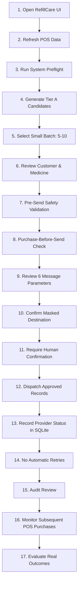

# PHASE 15 — REFILLCARE CONTROLLED PILOT EXECUTION, LIVE-SEND READINESS & REAL OUTCOME COLLECTION

## 1. Objective

The objective of **Phase 15** is to conduct the **final technical and operational preflight verification** required prior to executing a real-world controlled pilot for the RefillCare Medication Refill Reminder System, and to establish a safe, auditable, human-in-the-loop workflow for collecting real pilot outcomes.

Phase 15 enforces the operational boundary ensuring that:
1. **Zero live WhatsApp messages** are sent without separate, explicit user authorization.
2. **Zero live API requests** occur during startup, dataset loading, scheduling, UI navigation, or testing.
3. The **approved WhatsApp template** (`refillcare_medicine_reminder`, Utility, en, 6 parameters) remains strictly intact.
4. The **XGBoost machine learning model** and **6-stage reminder schedule** (`-7d, -3d, -1d, 0d, +2d, +5d`) remain frozen.
5. All **frozen legacy files** (`app.py`, `app_image_campaign.py`, `services/`, `utils/`) remain completely unmodified.

---

## 2. Current System State

| Component | Status | Verification Detail |
|---|---|---|
| **RefillCare Test Suite** | **PASS (137 passed, 0 failed)** | 100% test pass rate across `tests/refillcare/` and `tests/reminder/` |
| **Final Pilot Preflight** | **PASS (19/19 Checks Passed)** | Automated end-to-end operational assertions verified |
| **Controlled Pilot Execution Readiness** | **READY** | UI and backend controls ready for controlled dispatch |
| **Real Pilot Data** | **NOT YET AVAILABLE** | No real messages sent; observational baseline intact |
| **Real WhatsApp Messages Sent** | **0** | Zero real-world customer messages sent |
| **Live API Requests** | **0** | Zero external HTTP requests made to messaging providers |
| **Automatic Sending** | **DISABLED** | No cron jobs, background workers, or automated dispatchers |
| **Automatic Retries** | **DISABLED** | Failed messages require explicit manual operator action |
| **Dry-Run Mode** | **ENABLED (Default)** | Simulates full payload construction, validation, and audit |
| **Approved WhatsApp Template** | **FROZEN** | `refillcare_medicine_reminder` (6 body variables) |
| **XGBoost Prediction Model** | **FROZEN** | MAE: 5.10 days, Within ±3d: 57.0%, ±7d: 82.2% |
| **Reminder Schedule** | **FROZEN** | Fixed 6 stages: -7, -3, -1, 0, +2, +5 days |
| **Legacy WhatsApp Campaign** | **FROZEN** | Zero modifications to legacy files |
| **Privacy Compliance** | **PASS** | Full phone numbers masked (`***XXXX`) across UI & logs |

---

## 3. Authorization Boundary

> [!IMPORTANT]
> **CRITICAL AUTHORIZATION BOUNDARY**
>
> Phase 15 implementation and testing **DO NOT** authorize real WhatsApp message dispatch.
> 
> Real messaging can only occur when the user issues a separate, explicit authorization command (e.g., *"Authorize the real pilot send"*).
>
> Until that separate authorization exists:
> - Dry-Run remains permanently enabled by default.
> - Live dispatch controls require two-step confirmation with safety checks.
> - No customer will receive an unsolicited message.

---

## 4. Final Preflight Verification Engine

RefillCare incorporates a unified 19-point preflight verification engine (`refillcare.evaluation.pilot_preflight.run_comprehensive_pilot_preflight`):

| # | Preflight Check Item | Category | Status | Verification Detail |
|---|---|---|---|---|
| 1 | **Core App & Modules Import** | SYSTEM | **PASS** | `app_refillcare`, `pilot_operations`, `pilot_outcomes` imported cleanly |
| 2 | **Database Accessibility** | SYSTEM | **PASS** | SQLite audit database accessible and read/write capable |
| 3 | **Audit Table Schema & Indices** | SYSTEM | **PASS** | `reminder_audit` schema, indices, and constraints verified |
| 4 | **Prediction Model Bundle** | DATA_MODEL | **PASS** | `refill_model.joblib` (XGBoost) loaded and deserialized |
| 5 | **Evaluation Dataset Availability** | DATA_MODEL | **PASS** | Processed test/training datasets available for prediction |
| 6 | **Scheduler Cycle Generation** | SYSTEM | **PASS** | Deterministic 6-stage reminder cycle (-7d, -3d, -1d, 0d, +2d, +5d) |
| 7 | **Pilot Cohort Traceability** | GOVERNANCE | **PASS** | Pilot ID `PILOT-2026-01` with 30-day activity & observation windows |
| 8 | **Tier A Prioritization** | SAFETY | **PASS** | High history quality (>=5 purchases) prioritization active |
| 9 | **Template Name Exactness** | TEMPLATE | **PASS** | Template name matches `refillcare_medicine_reminder` |
| 10 | **Exact 6 Body Parameters** | TEMPLATE | **PASS** | Payload constructs exactly 6 sanitized parameters |
| 11 | **Phone Normalization** | SAFETY | **PASS** | E.164 normalization validated (10 digits -> `91XXXXXXXXXX`) |
| 12 | **Privacy Masking Compliance** | SAFETY | **PASS** | Phone numbers strictly masked to `***XXXX` in UI/logs |
| 13 | **Duplicate Dispatch Protection** | SAFETY | **PASS** | SQLite audit blocks duplicate sends for identical reminder IDs |
| 14 | **Cycle Reset Invalidation** | SAFETY | **PASS** | Post-prediction purchases invalidate stale scheduled reminders |
| 15 | **Shared-Phone Compound Isolation** | SAFETY | **PASS** | Identity strictly keyed by `customerId + itemId` |
| 16 | **Audit State Persistence** | SYSTEM | **PASS** | Review, approval, rejection, and dispatch state persist |
| 17 | **Dry-Run Safety Mode** | SAFETY | **PASS** | Zero external network calls generated during simulation |
| 18 | **Automation Disabled** | GOVERNANCE | **PASS** | Zero background workers, auto-send crons, or auto-retries |
| 19 | **Frozen Legacy Files** | GOVERNANCE | **PASS** | `git diff` confirms zero changes to legacy campaign files |

---

## 5. Pilot Cohort

The pilot operates strictly on the **Tier A Controlled-Pilot Cohort**:
- **Target Population:** Patients with recurring chronic medication refill patterns.
- **Inclusion Criteria:**
  - Minimum 5 historical purchases or 3 recurring cycle purchases.
  - Valid, non-null `customerId` and `itemId`.
  - Normalized, valid 10-digit Indian mobile number (`MOBILE_NO`).
  - Active invoice record with valid expected refill date.
- **Exclusion Criteria:**
  - Low history quality (< 3 purchases without recurrence).
  - Missing or invalid contact destination.
  - Prior dispatches in terminal or duplicate state.
  - Post-prediction purchase already recorded (stale reminder).

---

## 6. Small First Pilot Batch Sizing

To prevent uncontrolled messaging volume, the operator UI enforces small batch controls:
- **Available Batch Sizes:**
  - `5 Candidates (Recommended)` — Initial micro-pilot batch.
  - `10 Candidates` — Controlled second wave.
  - `20 Candidates` — Staged pilot batch.
  - `50 Candidates` — Maximum pilot tranche.
  - `All Eligible` — Explicit override with safety warnings.
- **Visual Batch Indicators:**
  - Displays `Selected Candidates (N)`, `Total Tier A Available`, `Total Eligible Queue`.
  - Each candidate displays: Customer Name, Medicine Name, Expected Refill Date, Reminder Stage, History Quality, Masked Phone (`***XXXX`), and Pre-Send Safety Status.

---

## 7. Operator Review & Structured Approval

Before any message can be dispatched:
1. Every candidate must be individually reviewed in the interactive Streamlit table.
2. The operator explicitly chooses **APPROVE** or **REJECT**.
3. **Structured Rejection Reasons:**
   - `customer already purchased`
   - `prediction appears incorrect`
   - `customer not appropriate`
   - `invalid contact`
   - `duplicate`
   - `operator decision`
   - `other`
4. Unreviewed or rejected candidates are automatically filtered out and cannot be dispatched.

---

## 8. Pre-Send Safety Validation

Prior to invoking any dispatch mechanism, the backend executes `validate_pre_send_safety`:
1. Customer identity and Item identity non-null check.
2. Template name exactness check (`refillcare_medicine_reminder`).
3. Exact 6 body parameter integrity check.
4. Parameter sanitization (no newlines, control characters, or length overflow).
5. Destination phone normalization (10-digit / 12-digit Indian format).
6. Prior dispatch check (ensures not previously `sent` or `accepted` in SQLite audit).
7. Active cycle check (ensures reminder is not cancelled or superseded).

---

## 9. Purchase-Before-Send Check

Immediately prior to dispatch, the system checks whether the patient has made a new purchase of the same medicine (`customerId + itemId`) since the prediction date:
- **If new purchase found:** The scheduled reminder is marked **CANCELLED** with reason `purchase_before_send_detected`.
- **Safety Impact:** Prevents sending embarrassing or confusing reminders to customers who have already refilled their prescription.

---

## 10. Shared Phone Isolation

RefillCare strictly isolates patient records sharing the same phone number (e.g., family members using one contact):
- **Identity Rule:** Canonical identity is always `customerId + itemId`.
- **Phone Rule:** Phone number is treated exclusively as a transmission destination, never as a primary or grouping key.
- **Protection:** Reminders for Patient A (Medicine X) and Patient B (Medicine Y) remain separate transactions, separate audit entries, and separate message payloads.

---

## 11. Dry-Run Mode

Dry-Run mode is active by default across all interfaces and tests:
- Generates exact JSON payload matching the WhatsApp Cloud API / Xinno specification.
- Validates all 6 parameters and phone formatting.
- Logs full audit record with `dispatch_mode = "dry_run"`.
- Makes **0 external HTTP requests**.
- Verifiable via automated mock assertions.

---

## 12. Live-Send Boundary

A clear operational wall separates Dry-Run from Live Send:
1. Live mode can only be activated via explicit UI toggle or operational flag.
2. Live dispatch requires a final confirmation modal detailing the exact number of approved records.
3. No automatic sending occurs during app launch, data loading, or page navigation.

---

## 13. Pilot Run Tracking

Every pilot execution is logged under a persistent `pilot_run_id` (e.g., `PILOT-2026-01`):
- Tracks: `run_date`, `operator_id`, `candidates_selected`, `approved_count`, `rejected_count`, `dispatched_count`, `accepted_count`, `failed_count`, `cancelled_count`.
- All operational metrics roll up into the Phase 14 / Phase 15 Pilot Monitoring Dashboard.

---

## 14. First Real Pilot Procedure

When real pilot messaging is separately authorized, operators will follow this exact 17-step protocol:

---

## 15. Real Pilot Outcome Collection

Following real pilot messaging, subsequent POS transactions will be tracked using `customerId + itemId`:
- **Metrics Collected:**
  - Prediction Error (`actual_refill_date - expected_refill_date`).
  - Reminder Timing relative to actual purchase (`actual_refill_date - reminder_date`).
  - Observation status (`PENDING_OBSERVATION` vs `MATURE`).
  - Post-reminder refill indicator.

---

## 16. Right-Censoring & Observation Windows

To avoid reporting biased or falsely pessimistic outcomes:
- **Observation Window:** 30 days post-reminder date.
- **Classification:**
  - If < 30 days have elapsed since reminder and no purchase has occurred: Mark as `PENDING OBSERVATION`.
  - If >= 30 days have elapsed without purchase: Mark as `NO OBSERVED REFILL WITHIN OBSERVATION WINDOW`.
- RefillCare never claims unobserved refills mean the patient purchased elsewhere; it records only pharmacy-observed refills.

---

## 17. Pilot Evaluation Metrics

| Metric Group | Specific Indicator | Calculation / Target |
|---|---|---|
| **Prediction Accuracy** | MAE / Median Absolute Error | Baseline: MAE 5.10 days, Median: 3.0 days |
| | Prediction Accuracy Bands | Target: Within ±3d (>=55%), Within ±7d (>=80%) |
| **Reminder Timing** | Pre-Refill / Same-Day Reminders | Target: >=75% reminders delivered before or on refill date |
| | Stale / Post-Refill Reminders | Target: 0% |
| **Operations** | Approval Rate / Rejection Rate | Traceable in audit database |
| | Provider Acceptance Rate | Target: >=95% |
| **Outcomes** | Post-Reminder Refill Rate | Observed pharmacy refills within observation window |

---

## 18. Structured Operator Feedback

Operator decisions are captured in SQLite with structured categories to identify systematic data or model patterns:
- Feedback categories are aggregated in the Pilot Monitoring view.
- Provides quantitative feedback on whether predictions are systematically early or late.

---

## 19. Pilot Stop Conditions

The operator must immediately pause pilot dispatch if any of the following stop conditions are detected:
1. **Repeated Stale Reminders:** > 5% of candidates flagged with post-prediction purchases.
2. **Abnormal Dispatch Failures:** Provider rejection rate > 10%.
3. **Duplicate Sends:** Any instance of duplicate dispatch for the same reminder ID.
4. **Identity Collisions:** Inconsistent customer-item mappings.
5. **Data Freshness Issues:** POS data latency > 48 hours.
6. **High Operator Rejection Rate:** > 30% of Tier A candidates rejected by operator.
7. **Customer Complaints:** Any recorded patient complaint regarding reminder accuracy or frequency.

---

## 20. Privacy & Security Verification

- **Full Phone Numbers:** Never logged, never displayed in cleartext in the UI, and never exported in cleartext. Masked as `***XXXX`.
- **API Credentials:** Loaded exclusively via environment variables (`WHATSAPP_TOKEN`, `WHATSAPP_PHONE_NUMBER_ID`); never hardcoded or printed.
- **Audit Logs:** Store only sanitized parameters, masked destinations, and deterministic IDs.

---

## 21. Testing Verification

All Phase 15 components have been thoroughly tested:
- `tests/refillcare/test_pilot_preflight.py` (9 tests)
  - Preflight passes on valid system.
  - Preflight detects missing model file.
  - Small batch selection restricts candidate count.
  - Human approval requirement blocks unreviewed dispatches.
  - Safety check blocks missing or invalid customer/phone.
  - Duplicate dispatch protection blocks re-sends.
  - Shared phone records maintain compound isolation.
  - WhatsApp payload contains exactly 6 body parameters.
  - UI phone masking strictly verified.
- Full test suite: **137 tests passing, 0 failed**.

---

## 22. Known Limitations

1. **Observational Nature:** Initial pilot outcomes represent observational associations, not randomized causal proof.
2. **External Purchases:** RefillCare cannot observe purchases made at competing pharmacy chains.
3. **Data Refresh Dependency:** Accurate pre-send checks rely on regular POS data ingestion.

---

## 23. First Pilot Checklist

### PRE-PILOT
- [ ] Latest POS transaction data imported and refreshed.
- [ ] 19-point System Preflight reports **PASS**.
- [ ] SQLite audit database accessible and clean.
- [ ] Prediction model loaded (`refill_model.joblib`).
- [ ] WhatsApp template name verified (`refillcare_medicine_reminder`).
- [ ] Exact 6 body parameters verified.
- [ ] Tier A candidates generated.
- [ ] Small pilot batch (5–10 candidates) selected.

### PER-CANDIDATE REVIEW
- [ ] `customerId` and `itemId` verified.
- [ ] Medicine name and dosage confirmed.
- [ ] Expected refill date reviewed against purchase history.
- [ ] Reminder stage (-7d to +5d) verified.
- [ ] Masked phone (`***XXXX`) verified.
- [ ] Purchase-before-send check passed (no newer purchase).
- [ ] Duplicate dispatch check passed.
- [ ] Operator explicitly marks candidate **APPROVED**.

### BEFORE LIVE SEND
- [ ] Separate explicit user authorization received for live dispatch.
- [ ] Live Send mode intentionally selected.
- [ ] Final approved batch count confirmed.
- [ ] Operator triggers final dispatch confirmation.

### POST-SEND AUDIT
- [ ] Provider acceptance responses audited in SQLite.
- [ ] Zero automatic retries initiated.
- [ ] Pilot run session recorded and closed.
- [ ] 30-day outcome observation window initiated.

---

## 24. Post-Pilot Evaluation Protocol

Following completion of the first pilot run:
1. Track POS purchase events daily against the cohort.
2. At Day 14 and Day 30, evaluate prediction MAE, timing accuracy, and observed refill rates.
3. Compare against offline benchmark (MAE 5.10d, ±3d: 57.0%, ±7d: 82.2%).
4. Present findings in Phase 16 before considering batch expansion or model retraining.

---

## 25. Recommendation

1. **Current Decision:** **INSUFFICIENT DATA** (Real pilot evidence is not yet available).
2. **Execution State:** **READY FOR CONTROLLED PILOT** (awaiting separate user authorization).
3. **Model Retraining:** **NOT YET RECOMMENDED** (Maintain frozen XGBoost model until real-world outcomes are collected).
4. **Next Step:** Await explicit user authorization to initiate the first small batch (5 candidates) Tier A pilot run under supervised Dry-Run / Live protocol.
