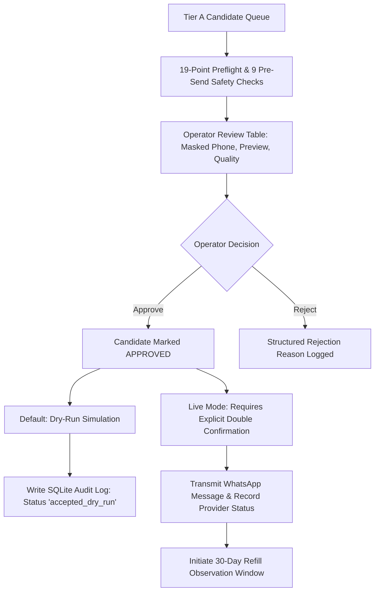

# PHASE 16 — REFILLCARE FIRST CONTROLLED MICRO-PILOT REPORT

## 1. Executive Summary

Phase 16 establishes the technical architecture, safety surveillance, outcome capture, and human-in-the-loop controls for **RefillCare's First Controlled Micro-Pilot**.

### Current Verified Operational State
- **RefillCare Test Suite:** **146 passed, 0 failed**
- **Controlled Micro-Pilot Readiness:** **READY**
- **Real Pilot Data:** **NOT YET AVAILABLE** (Observational baseline intact)
- **Real WhatsApp Messages Sent:** **0**
- **Live API Requests:** **0**
- **Automatic Sending:** **DISABLED** (Zero background workers or cron dispatchers)
- **Automatic Retries:** **DISABLED** (Failures require explicit manual operator action)
- **Dry-Run Mode:** **ENABLED (Default)**
- **Approved WhatsApp Template:** **FROZEN** (`refillcare_medicine_reminder`, Utility, en, text, 6 body variables)
- **XGBoost Prediction Model:** **FROZEN** (MAE: 5.10 days, ±3d: 57.0%, ±7d: 82.2%)
- **Reminder Schedule:** **FROZEN** (Fixed 6 stages: -7, -3, -1, 0, +2, +5 days)
- **Frozen Legacy Files:** **PASS** (`git diff` confirms 0 changes across `app.py`, `app_image_campaign.py`, `services/`, `utils/`)

---

## 2. Micro-Pilot Scope & Batch Sizing

To ensure strict human oversight and zero risk of mass unintended messaging, Phase 16 introduces **Micro-Batch Sizing**:
- **Allowed Batch Sizes:** Strictly **5** (Default Micro-Batch), **10**, or **20** candidates.
- **Target Population:** Restricted strictly to **Tier A (Strong Pilot)** candidates.
- **Inclusion Criteria:**
  - High history quality ($\ge 5$ historical purchases or $\ge 3$ recurring cycles).
  - Valid, non-null `customerId` and `itemId`.
  - Normalized Indian mobile number (`91XXXXXXXXXX`).
  - Active invoice baseline with verified expected refill date.
- **Exclusion Criteria:**
  - Tier B (Review Required) and Tier C (Cold-Start / Suppressed).
  - Incomplete or malformed contact destinations.
  - Stale reminders superseded by newer purchase events.

---

## 3. Compound Identity & Shared Phone Isolation

RefillCare strictly isolates patient records sharing the same phone number (e.g. family members):
- **Canonical Identity:** Always defined by the composite key `(customerId, itemId)`.
- **Destination Principle:** Phone number is treated exclusively as a transmission destination, never as a primary or grouping key.
- **Isolation Rule:** Reminders for Customer A (Medicine X) and Customer B (Medicine Y) remain separate queue entries, separate audit rows, and separate message payloads even if their destination phone numbers are identical.

---

## 4. Multi-Assertion Pre-Send Safety Engine

Every candidate in the micro-pilot review queue undergoes **9 automated pre-send safety assertions** before approval:
1. Non-null and non-empty `customerId` and `itemId`.
2. Valid destination phone number meeting E.164 normalization standards.
3. Deterministic unique `reminder_id` generated.
4. SQLite audit verification ensuring reminder is not already dispatched or terminal.
5. Cycle-reset verification confirming no newer purchase has occurred for `(customerId, itemId)` since prediction date.
6. Exact approved template name match (`refillcare_medicine_reminder`).
7. Exact 6 body parameter integrity check.
8. Parameter sanitization (no control characters, length overflow, or sensitive tokens).
9. Privacy masking verification (`***XXXX` in UI, logs, and exports).

---

## 5. Human Operator Review & Approval Workflow

---

## 6. Micro-Pilot Stop Conditions Surveillance

The runtime engine continuously monitors 7 operational stop conditions:

| Stop Condition | Severity | Description & Trigger Criteria |
|---|---|---|
| **Duplicate Send Prevention** | `CRITICAL_STOP` | Collision detected in candidate reminder IDs |
| **Newer Purchase Cycle Reset** | `WARNING` / `CRITICAL_STOP` | Patient purchased medicine after prediction was made |
| **Destination Phone Normalization** | `CRITICAL_STOP` | Destination fails 12-digit Indian mobile format |
| **WhatsApp Template Exactness** | `CRITICAL_STOP` | Template name or 6 body parameter mismatch |
| **Provider Dispatch Failure Rate** | `CRITICAL_STOP` | Provider rejection rate $> 10\%$ across $\ge 5$ dispatches |
| **Prediction Anomaly Surveillance** | `WARNING` | Predicted interval $< 3$ days or $> 180$ days |
| **Persistent Audit Storage Access** | `CRITICAL_STOP` | SQLite database file inaccessible or locked |

---

## 7. Outcome Collection & Right-Censoring Protocol

Following micro-pilot dispatch, subsequent POS purchases are tracked to evaluate refill adherence:
- **Matching Rule:** Exact match on `customerId + itemId` with `invoice_date >= reminder_date`.
- **Right-Censoring Handling:**
  - **`OBSERVED_REFILL`**: Subsequent purchase observed within the observation window.
  - **`PENDING_OBSERVATION`**: $< 30$ days have elapsed since reminder date without an observed refill (observation window remains open).
  - **`NO_OBSERVED_REFILL`**: $\ge 30$ days have elapsed without an observed purchase (window expired).
- **Causality Integrity:** Observed refills are reported strictly as observational associations (*"post-reminder refill rate"*), never as unproven causal claims.

---

## 8. Privacy & Security Compliance

- **Masked Phone Numbers:** Displayed and logged exclusively in `***XXXX` format.
- **No Secret Exposure:** API tokens and credentials loaded exclusively via environment variables.
- **Export Sanitization:** Exportable CSVs and Markdown reports omit cleartext mobile numbers and authentication headers.

---

## 9. Test Suite Verification

The Phase 16 test suite ([tests/refillcare/test_micro_pilot.py](file:///c:/Users/sunil/ai-mediastra-whatsapp-reminder/ai-mediastra-whatsapp-reminder/tests/refillcare/test_micro_pilot.py)) adds 9 comprehensive tests covering:
- Batch sizing (5, 10, 20) and Tier A filtering.
- Compound identity isolation on shared phone numbers.
- Operator approval requirement (unapproved candidates blocked).
- Dry-Run zero external request assertion.
- Live send boundary and provider status recording ("accepted", "failed").
- Repurchase cycle reset interception.
- Operational stop condition surveillance.
- Outcome tracking and 30-day right-censoring.
- Privacy masking across outputs.

**Total RefillCare Tests:** **146 passed, 0 failed**.

---

## 10. Blockers & Decisions Requiring User Action

1. **Explicit Live-Send Authorization:** RefillCare is in full readiness. No real WhatsApp message will be sent until the user explicitly issues an authorization command (e.g., *"Authorize the real pilot send"*).
2. **Current Decision:** **INSUFFICIENT DATA** (Real pilot outcome data will be gathered once the first micro-batch is executed and observed across subsequent POS transactions).
