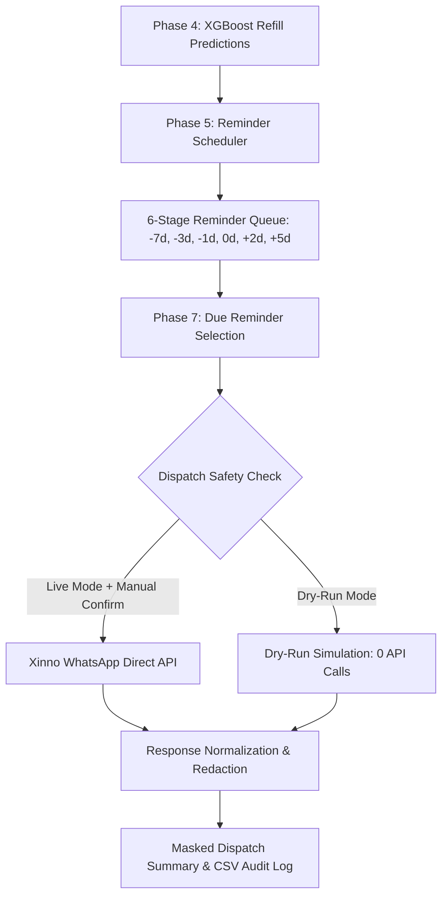

# PHASE 7 — RefillCare Controlled WhatsApp Reminder Dispatch

## 1. Executive Summary & Objective

**RefillCare Phase 7** bridges the deterministic 6-stage reminder schedule queue (built in Phase 5) to the approved **Xinno WhatsApp Business API** service (`services.xinno_whatsapp`).

### Core Safety Guarantees:
1. **Zero Automatic Sending:** Reminders are never dispatched upon Streamlit startup or model execution.
2. **Explicit Manual Confirmation:** Real WhatsApp transmission strictly requires explicit operator selection, review, and dual-confirmation within the RefillCare interface.
3. **Dry-Run by Default:** All automated tests and default UI interactions operate in simulated Dry-Run mode, executing zero external HTTP requests.
4. **Frozen Foundation Preservation:** Legacy campaign services, `app.py`, `app_image_campaign.py`, and base utility modules remain 100% frozen and unmodified.
5. **No Credential Exposure:** API keys, WABA endpoints, authorization headers, and raw JSON payloads are never exposed to the UI, client logs, or exported reports.

---

## 2. Dispatch Architecture



### Component Breakdown:
- **`reminder/dispatch.py`**:
  - `RefillCareReminderDispatcher`: Core dispatch orchestrator managing API communication, state tracking, and duplicate prevention.
  - `select_eligible_reminders_for_dispatch`: Filter engine extracting scheduled reminders matching a given due date with valid identifiers.
  - `build_refillcare_whatsapp_payload`: Builds the deterministic WhatsApp template body with 5 sanitized variables.
  - `mask_phone_for_ui`: Redacts destination phone numbers to last 4 digits (e.g., `***2345`).
- **`app_refillcare.py` (Tab 3: Controlled WhatsApp Dispatch)**:
  - Pharmacy operator interface for selecting due dates, reviewing message previews, configuring store metadata, and authorizing sends.

---

## 3. Approved RefillCare WhatsApp Template

Dispatch uses the approved, standardized WhatsApp Business template:

| Property | Approved Value |
| :--- | :--- |
| **Template Name** | `refillcare_medicine_reminder` |
| **Language** | `en` (deterministic policy) |
| **Category** | Utility / Refill Reminder |
| **Header** | None |

### Template Body Variables:

| Variable | Field | Source | Example Value |
| :--- | :--- | :--- | :--- |
| `{{1}}` | **Customer Name** | `customerName` or sanitized `customerId` | `John Doe` |
| `{{2}}` | **Store Name** | Environment `MEDICAL_STORE_NAME` or UI input | `PHARMA HUBB` |
| `{{3}}` | **Reminder Stage Message** | Generated by Phase 5 Scheduler | `Your regular medicine refill may be due in about 7 days, around 09-09-2026.` |
| `{{4}}` | **Medication Name** | `itemName` or sanitized `itemId` | `TELMISARTAN 40MG` |
| `{{5}}` | **Store Contact** | Environment `STORE_CONTACT_NUMBER` or UI input | `9876543210` |

> [!IMPORTANT]
> Template text is strictly deterministic and owned by the Phase 5 business engine. No LLM generates or alters clinical reminder text. Control characters (`\r`, `\n`, `\t`) are automatically sanitized to prevent provider rejection.

---

## 4. Phone Number & Identity Handling

- **Identity Principle:** Refill identity is strictly defined by the composite key `customerId + itemId`.
- **Delivery Destination Only:** The phone number (`MOBILE_NO`) is solely a transport delivery address, **never** a primary key or customer identifier.
- **Shared Phone Preservation:** If two distinct patients share the same phone number (e.g., family members or dependents), their reminder histories and dispatch records remain completely separate and are never deduplicated against each other.
- **Normalization:** All phone numbers are validated and converted to standard 12-digit Indian E.164 format (`91XXXXXXXXXX`) using `services.xinno_whatsapp.normalize_phone_number`.
- **Privacy Masking:** The UI and audit logs only expose masked phone numbers (e.g., `***2345`), preventing unnecessary PII exposure.

---

## 5. Duplicate & Idempotency Protection

Each reminder touchpoint possesses a unique deterministic identifier:
$$\text{Reminder ID} = \text{customerId}\_\_\_\text{itemId}\_\_\_\text{expected\_refill\_date}\_\_\_\text{stage}$$

### Multi-Tier Safeguards:
1. **Lifetime Sent State Tracking:** Reminders that have already been accepted or sent by the dispatcher are recorded in `sent_reminder_ids` and are blocked from repeated dispatch.
2. **In-Batch Deduplication:** If an identical reminder ID appears multiple times within a single dispatch request batch, only the first instance is executed; subsequent occurrences are marked `duplicate_prevented`.
3. **Cancelled Cycle Suppression:** Reminders marked with `cancelled` or `completed` status in the Phase 5 queue are rejected prior to payload generation.

---

## 6. Dispatch Lifecycle Statuses

```
   [scheduled]
        │
        ▼
   [validating] ─────────► [invalid] (Missing ID / Bad Phone / Missing Date)
        │
        ▼
 [duplicate_check] ──────► [duplicate_prevented] (Already sent)
        │
        ▼
    [sending]
   ┌────┴──────────────────────────┐
   ▼                               ▼
[accepted] (HTTP 200 / Dry-Run)  [failed] (Provider Error / Network Exception)
```

---

## 7. Dry-Run & Testing Safety

- **Zero Real API Calls:** Setting `dry_run=True` (the default) executes the complete validation pipeline, generates identical template payloads, tests duplicate protection, and returns normalized `accepted` status (`status_code=200`, `provider_message_id="DRY_RUN_MSG_..."`) without initiating any network connection.
- **Automated Test Isolation:** All automated tests in `tests/refillcare/test_dispatch.py` operate exclusively under Dry-Run or mocked `requests.post` fixtures.

---

## 8. Streamlit Operational Workflow (Tab 3)

1. **Date Selection:** Operator selects the target due date (e.g., today's date).
2. **Due Reminder Inspection:** System filters scheduled records due on the selected date and renders a review table showing patient name, medication, expected refill date, stage message preview, and masked phone (`***2345`).
3. **Dry-Run Toggle:** Operator verifies settings with Dry-Run mode enabled.
4. **Explicit Confirmation:** Operator checks the mandatory authorization box: *"I have reviewed the recipient list and authorize dispatching these reminders via WhatsApp."*
5. **Dispatch Execution:** Operator clicks the dispatch button to process the batch.
6. **Audit & Log Export:** An execution metrics card and detailed result table are displayed with one-click CSV log download.

---

## 9. Verification & Test Coverage

All 14 tests in `tests/refillcare/test_dispatch.py` pass:
- Import and constant validation
- Template sanitization & newline stripping
- 5-parameter payload construction
- Validation failure detection (missing IDs, bad phones, invalid dates)
- Dry-run safety (zero network calls)
- Multi-tier duplicate protection
- In-batch deduplication
- Cancelled reminder suppression
- Shared phone preservation across distinct customers
- Mocked 200 HTTP provider success
- Mocked 400 HTTP provider failure & redaction
- Network timeout & exception handling
- DataFrame result export and masking

---

## 10. Boundaries & Next Steps

### Current Limitations:
- Dispatch requires manual operator initiation via the RefillCare Streamlit UI or programmatic batch execution.
- No automated cron jobs or unmonitored background workers are configured.
