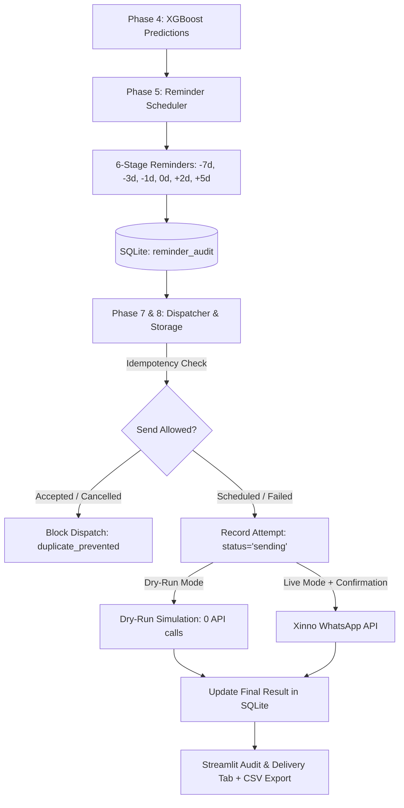

# PHASE 8 — RefillCare Persistent Reminder State & Audit

## 1. Executive Summary & Objective

**RefillCare Phase 8** adds local SQLite persistence and an immutable operational audit trail to the Medication Refill Reminder System. It guarantees that reminder scheduling states, dispatch attempts, WhatsApp provider message IDs, and failure diagnostics survive application restarts while maintaining idempotency and privacy.

### Key Capabilities & Safeguards:
1. **Persistent State:** All scheduled touchpoints and dispatch outcomes are stored in a local, git-ignored SQLite database (`data/refillcare/processed/refillcare.db`).
2. **Restart-Resilient Idempotency:** Duplicate prevention checks persistent storage, ensuring accepted WhatsApp messages are never re-transmitted across application restarts or duplicate UI button clicks.
3. **Audit Trail & Observability:** Dedicated "Audit & Delivery History" tab in Streamlit displaying attempt counts, provider message IDs, timestamps, and error diagnostics with CSV export.
4. **Controlled Manual Retry:** Failed reminders can be reviewed and retried with explicit operator authorization. Accepted or cancelled cycles are strictly protected against accidental retries.
5. **Privacy & Security:** Full phone numbers are never stored in SQLite (only `phone_last4` is retained); API credentials and raw provider headers are never logged or exported.

---

## 2. System Architecture



---

## 3. SQLite Database Schema

The database is located by default at `data/refillcare/processed/refillcare.db` and is auto-initialized on first run.

### Table: `reminder_audit`

| Column | Type | Constraints | Description |
| :--- | :--- | :--- | :--- |
| `reminder_id` | `TEXT` | `PRIMARY KEY` | Deterministic ID: `customerId___itemId___expected_refill_date___stage` |
| `customer_id` | `TEXT` | `NOT NULL` | Unique customer identifier |
| `item_id` | `TEXT` | `NOT NULL` | Unique medication item identifier |
| `customer_name`| `TEXT` | | Patient name for operational review |
| `item_name` | `TEXT` | | Medicine name |
| `phone_last4` | `TEXT` | | Last 4 digits of delivery phone (e.g. `2345`) |
| `expected_refill_date` | `TEXT` | | Predicted refill date (`YYYY-MM-DD`) |
| `reminder_date` | `TEXT` | | Due reminder date (`YYYY-MM-DD`) |
| `reminder_stage` | `TEXT` | | Stage tag (e.g. `-7d`, `-3d`, `0d`, `+5d`) |
| `history_quality`| `TEXT` | | Confidence tier (`high_history`, `medium_history`, `low_history`) |
| `status` | `TEXT` | `NOT NULL` | `scheduled`, `sending`, `accepted`, `failed`, `cancelled`, `duplicate_prevented`, `invalid` |
| `attempt_count` | `INTEGER` | `DEFAULT 0` | Total number of dispatch attempts |
| `provider_message_id` | `TEXT` | | Sanitized WhatsApp message ID (e.g. `wamid.HBg...`) |
| `error_category` | `TEXT` | | High-level diagnostic category (e.g. `Validation Error`, `API Error`) |
| `error_message` | `TEXT` | | Redacted human-readable error description |
| `is_dry_run` | `INTEGER` | `DEFAULT 0` | `1` if simulated in dry-run mode, `0` if live dispatch |
| `created_at` | `TEXT` | `NOT NULL` | Record creation UTC timestamp (ISO 8601) |
| `updated_at` | `TEXT` | `NOT NULL` | Last status update UTC timestamp (ISO 8601) |
| `last_attempt_at`| `TEXT` | | Timestamp of most recent dispatch attempt |

### Indices:
- `idx_audit_status` on `reminder_audit(status)`
- `idx_audit_customer` on `reminder_audit(customer_id)`
- `idx_audit_reminder_date` on `reminder_audit(reminder_date)`
- `idx_audit_updated_at` on `reminder_audit(updated_at)`

---

## 4. Idempotency & Lifecycle State Machine

```
                  [scheduled] (attempt_count=0)
                       │
       ┌───────────────┴───────────────┐
       ▼                               ▼
 [cancelled] (Cycle reset)      [sending] (attempt_count += 1)
                                       │
                      ┌────────────────┴────────────────┐
                      ▼                                 ▼
         [accepted] (Live / Dry-run)                 [failed]
                      │                                 │
           (Resending Blocked)                 (Manual Retry Allowed)
                                                        │
                                                        ▼
                                                    [sending]
```

### Idempotency Enforcement:
1. **Pre-Dispatch Check (`is_send_allowed`):**
   - If `status == 'accepted'` and `is_dry_run == 0`: Blocked. Returns `duplicate_prevented`.
   - If `status == 'cancelled'`: Blocked. Returns `cancelled`.
   - If `status == 'sending'`: Blocked. Prevents concurrent dispatch during rapid UI clicks.
2. **Attempt Recording:** Before making the network call, status transitions to `sending` and `attempt_count` is incremented.
3. **Outcome Finalization:** Once the provider responds or dry-run completes, the record is updated with final status, provider message ID, and sanitized error diagnostics.

---

## 5. Phone Handling & Patient Identity Rules

- **Refill Identity:** Strictly defined by `customerId + itemId`.
- **Delivery Transport Only:** `MOBILE_NO` is exclusively a delivery destination and is never used as primary key.
- **Shared Phone Isolation:** Distinct family members or patients sharing a single phone number create independent `reminder_id` keys and separate audit records.
- **Redaction:** Only the last 4 digits (`phone_last4`) are persisted in SQLite and displayed in the audit table (`***2345`). Full phone numbers are handled strictly in memory during payload creation.

---

## 6. Provider Acceptance vs. End-Device Delivery

> [!IMPORTANT]
> The status **`accepted`** indicates that the WhatsApp Business API provider (Xinno) accepted and queued the message request. It does **not** guarantee delivery to the customer's physical handset or reading of the message. Delivery receipts / webhooks are not implemented in this phase.

---

## 7. Streamlit Operations & Delivery Audit (Tab 4)

- **Audit Overview:** Displays all persisted reminder records with filters for status, stage, customer name, and medicine.
- **Dashboard Summary Metrics:** Shows real-time counts from SQLite: Total Scheduled, Eligible Regimens, Accepted (Live), Accepted (Dry-Run), and Failed.
- **Manual Retry Action:**
  - Identifies failed reminders.
  - Displays previous failure reason and attempt count.
  - Requires explicit operator confirmation checkbox before triggering retry.
- **CSV Audit Export:** One-click download of the complete audit trail for compliance and reporting.

---

## 8. Verification & Test Coverage

All 76 tests across `tests/refillcare/` pass:
- Database initialization and table creation
- Scheduled reminder insertion and retrieval
- Redaction verification (no full phone numbers / credentials stored)
- Attempt count incrementation across multiple tries
- Idempotency protection against duplicate sends
- Cancelled cycle suppression
- Failed reminder retry qualification
- Shared phone number isolation
- Dry-run simulation audit tracking
- Persistence across separate `RefillCareStorage` instances
- DataFrame conversion and filtering
- Dashboard metrics aggregation

---

## 9. Limitations & Boundaries
- **No Background Automation:** All reminder preparation, dispatch, and retries require manual initiation in the RefillCare UI or via script.
- **No Inbound Webhooks:** Does not process asynchronous delivery/read status webhooks from Meta/Xinno.
