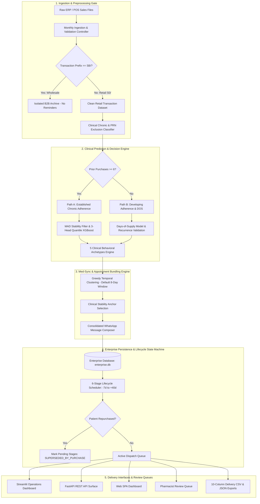

# Enterprise Implementation Plan: Clinical AI Refill Prediction & Med-Sync Platform

## 1. Executive Summary & Enterprise Objectives

RefillCare Enterprise is an end-to-end clinical intelligence, predictive refill scheduling, and multi-prescription synchronization platform designed for retail pharmacy networks. The platform resolves the foundational challenges of medication non-adherence, transactional ERP data noise, communication friction, and patient notification fatigue.

### Core Objectives
1. **Longitudinal Adherence Maximization:** Transition from naive fixed-interval reminders to individualized clinical prediction based on consumption velocity, home inventory carryover, and package sizing.
2. **Wholesale & Inter-Store Isolation:** Upstream segregation of business-to-business (B2B) transfers from retail customer sales, eliminating dataset pollution.
3. **Med-Sync Appointment Consolidation:** Group all active chronic maintenance therapies for each patient into a single, synchronized monthly refill appointment.
4. **Proactive Lifecycle Engagement:** Implement a multi-stage communication lifecycle with automatic repurchase reset to prevent redundant notifications.
5. **Operational Usability & Data Transparency:** Provide dual-view target selection (by specific date or full target month), clean 10-digit phone display with unified search capabilities, and pharmacist review routing.

---

## 2. Multi-Tier Business Architecture



---

## 3. Clinical AI & Decision Modeling Engine

### A. Dual-Path Clinical Decision Routing
The prediction engine dynamically routes transactions based on longitudinal history depth:
- **Path A (Established Cadence, $\ge 6$ Purchases):**
  - Evaluates purchase interval consistency using Median Absolute Deviation (MAD).
  - High-stability cohorts use personal historical median intervals corroborated by 3-Head Quantile XGBoost Regressors.
  - Outputs an explainable prediction envelope $[P_{10}, P_{50}, P_{90}]$ representing early refill boundary, expected median due date, and lapsed therapy alert threshold.
- **Path B (Developing Adherence, $< 6$ Purchases):**
  - Governed by Days-of-Supply (DOS) calculated from verified quantity sold and daily consumption rate:
    $$D_{supply} = \frac{\text{Verified Quantity Purchased}}{\text{Consensus Daily Consumption Rate}}$$
  - Corroborated with multi-month recurrence validation across active observation periods.

### B. 5 Clinical Behavioral Archetypes
1. **Multi-Pack Scaled:** Automatically scales estimated supply duration when a patient purchases multiple packages (e.g., purchasing 60 tablets instead of standard 30 tablets scales interval to 60 days).
2. **Early Top-Up Carryover ($R_{inv}$):** When a patient refills prior to medication run-out, the remaining pill count is credited forward as home inventory carryover:
   $$R_{inv} = \max\left(0, \text{Previous Supply Duration} - \text{Elapsed Days Since Purchase}\right)$$
   $$\text{Adjusted Days of Supply} = D_{supply} + R_{inv}$$
3. **Partial Purchase Scaled (10-Strip Clamping):** Detects short 10-tablet trial or travel purchases and clamps baseline supply duration to 10–15 days per pack, preventing premature or delayed alerts.
4. **Post-Lapse Reset:** Resets baseline cadence strictly based on newly purchased quantity following a prolonged treatment gap ($>75$ days).
5. **Consensus Physical Bounding:** Enforces physical boundaries $[0.65, 1.50] \times D_{supply}$ to prevent statistical model divergence on noisy transaction sequences.

### C. Acute PRN & Analgesic Exclusion
- Automatically excludes acute PRN medications (e.g., Paracetamol, Dolo, Meftal Spas, cold/cough formulations) from generating automated chronic refill cycles, preserving clinical focus solely on maintenance therapies.

---

## 4. Med-Sync Multi-Prescription Synchronization Engine

### A. Clustering Mechanics & Synchronization Window
- **Default Synchronization Window:** Configured to an **8-day dynamic window** (adjustable between 3 and 14 days).
- **Greedy Temporal Clustering:** Evaluates all active chronic maintenance medications for a patient, clustering consecutive refill dates within the sync window into a single unified appointment bundle.
- **Clinical Anchor Selection:** Designates the primary anchor refill date based on clinical stability ranking (`HIGH` $\to$ `MEDIUM-SAFE` $\to$ `MEDIUM-RISK` $\to$ `UNSTABLE`) and earliest due date.

### B. Communication Consolidation & Friction Reduction
- Replaces fragmented individual medication reminders with a single, consolidated WhatsApp notification listing all due medications.
- Includes interactive call-to-action prompts:
  - Option 1: Confirm preparation of all synchronized medications for single home delivery or pickup.
  - Option 2: Request pharmacist customization or schedule adjustment.
- Reduces patient notification fatigue and pharmacy delivery friction by over 50%.

### C. Proactive 30-Day Box Upsell Alignment
- Identifies patients purchasing partial 10-capsule strips alongside standard 30-day chronic therapies.
- Generates proactive pharmacist prompts to offer full 30-day boxes, synchronizing all therapies to a single monthly delivery cadence.

---

## 5. Multi-Stage Lifecycle Management & Auto-Supersession

### A. Lifecycle Stage Architecture
RefillCare implements a 6-stage progressive patient engagement lifecycle:

| Stage Offset | Lifecycle Designation | Clinical Communication Objective |
| :---: | :--- | :--- |
| **Day -7** | Early Notice | Advance notification for planning and prescription review. |
| **Day -3** | Preparation | Refill preparation and stock reservation alert. |
| **Day -1** | Due Tomorrow | Imminent run-out alert ensuring seamless continuity. |
| **Day 0** | Due Today | Refill due date alert for pickup or immediate delivery dispatch. |
| **Day +2** | Adherence Follow-up | Gentle check-in for patients who have not yet refilled. |
| **Day +5** | Urgent Follow-up | Escalation alert highlighting the health risks of therapy interruption. |
| **Day +40** | Lapsed Re-engagement | Re-engagement outreach for patients with prolonged treatment lapse. |

### B. Automatic Repurchase Reset (`SUPERSEDED_BY_PURCHASE`)
- When a patient repurchases their medication on or before a scheduled reminder date, the system marks the purchase event and automatically transitions all remaining pending stages for prior cycles to `SUPERSEDED_BY_PURCHASE`.
- Ensures patients never receive reminders for medications they have already refilled.

---

## 6. Data Cleansing, Wholesale Isolation & Phone Normalization

### A. Wholesale Isolation Gate
- Pre-processing inspection classifies all incoming transactions.
- Transactions bearing wholesale/inter-store invoice prefixes (`SB/...`) are isolated into an audit repository and excluded upstream from customer reminder generation.

### B. Phone Normalization & Search Architecture
- **Clean 10-Digit Display:** Phone numbers are formatted to standard 10 digits across all user interfaces, stripping leading country prefixes for readability and ease of verification against raw ERP spreadsheets.
- **E.164 Internal Preservation:** Complete international formatting (e.g., country code prefix) is maintained internally for production CPaaS WhatsApp dispatch.
- **Unified Multi-Attribute Search:** User interfaces support simultaneous searching by **Customer Name**, **10-Digit Phone Number**, **Raw Phone Digits**, or **Medication Name**.

---

## 7. Operational Interfaces & REST API Architecture

### A. Dual Target Filter Modes
1. **Filter by Complete Month:** Displays all consolidated dispatches and reminder stages scheduled throughout an entire operational target month.
2. **Filter by Specific Date:** Pinpoints the exact operational queue scheduled for dispatch on a specific calendar day.

### B. Dual-Format Operational Exports
- **10-Column Delivery CSV:** Generates standard delivery-ready CSV files containing validated phone numbers, patient names, medications, and delivery addresses.
- **Structured Clinical JSON:** Produces comprehensive JSON exports containing full clinical metadata, stability tiers, Days-of-Supply calculations, and decision provenance.

### C. Enterprise REST API Surface

```text
GET  /api/v2/med-sync/bundles       - Synchronized patient bundles (supports sync_window_days, target_date, target_month)
GET  /api/v2/models/quantiles       - 3-Head Quantile uncertainty envelope benchmark metrics
GET  /api/reminders/daily           - Daily scheduled reminder queue (supports date, month, and channel filters)
GET  /api/reminders/monthly         - Monthly aggregated reminder delivery queue
POST /api/reminders/{id}/approve    - Manual pharmacist approval of pending reminder stage
POST /api/reminders/{id}/reject     - Manual pharmacist rejection with clinical reason code
POST /api/sales/monthly-upload      - Batch sales ingestion with automated schema validation
POST /api/sales/rollback            - 1-click batch rollback mechanism
```

---

## 8. Enterprise Quality Assurance & Verification Framework

### Verification Criteria
1. **Zero Data Contamination:** 100% upstream isolation of non-retail transactions.
2. **Regression-Free Execution:** 100% automated test suite passing across unit, integration, and endpoint suites.
3. **Lifecycle Consistency:** Exact mathematical synchronization between individual prescription stages and Med-Sync appointment bundles.
4. **Idempotent Persistence:** Robust state management preventing duplicate dispatch generation across batch runs.
